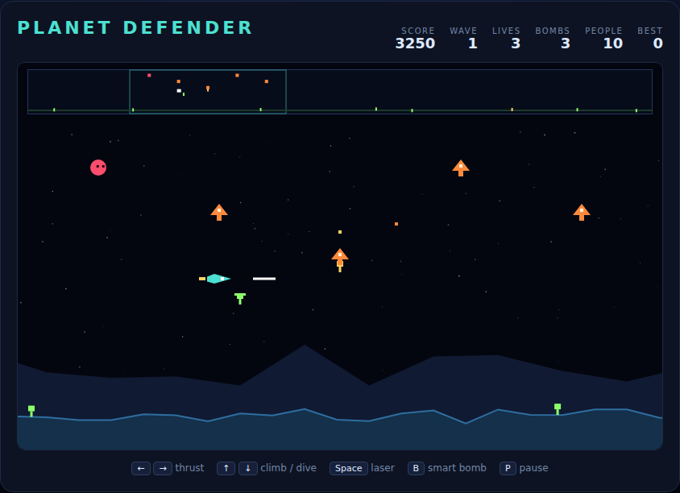

# Planet Defender

A side-scrolling rescue shooter on an HTML5 canvas. The planet is four screens
wide and joined end to end, so flying far enough in one direction brings you back
where you started. Ten humanoids live on the surface below; alien landers drop
out of the sky to carry them off, and any lander that escapes with a captive
returns as a mutant that hunts only you. A scanner across the top of the screen
shows the whole planet, because the abduction you need to stop is almost always
happening somewhere you cannot see.



## Playing

Open `index.html` in any modern browser. No build step and no server required.

## Controls

| Input | Action |
|---|---|
| `←` `→` / `A` `D` | thrust left / right (the ship flips to face the way you push) |
| `↑` `↓` / `W` `S` | climb / dive |
| `Space` | fire the laser (also starts the game when idle or after game over) |
| `B` | smart bomb |
| `P` | pause / resume |

## How to play

**Read the scanner.** The strip along the top is the entire planet squeezed into
one band: white is you, orange are landers, red are mutants, purple are baiters
and green are the humanoids. The cyan box marks the slice you can actually see.
Anything happening outside that box is happening without you.

**Stop the abductions.** A lander drifts toward the nearest humanoid, drops on it
and hauls it upward. If it reaches the top of the atmosphere the humanoid is gone
for good and the lander comes back as a mutant — faster, erratic and interested
only in ramming you. Shoot the lander before it climbs out of the sky.

**Catch what you drop.** Shooting a lander that is already carrying somebody sets
that humanoid falling. From low down they land safely; from high up they die on
impact — unless you fly into them, catch them, and dive to the surface to set
them down. A catch is worth 500 points and so is the safe landing.

**Use the bomb.** `B` destroys every enemy currently on screen and you start with
three, earning one more each wave (up to six). It clears what you can see, not
what the scanner shows, so position still matters.

**Do not lose the planet.** If the last humanoid dies, the surface turns to
rubble, every lander on the field mutates at once and the wave becomes a straight
survival fight. Live through it and the planet is repopulated for the next wave.

## Scoring

| Event | Points |
|---|---|
| Lander or mutant destroyed | 150 |
| Baiter destroyed | 200 |
| Catching a falling humanoid | 500 |
| Setting a humanoid safely down | 500 |
| Clearing a wave | 100 × wave × surviving humanoids |

An extra life every 10,000 points. Your best score is kept in `localStorage`.

## Tests

```powershell
npx playwright test PlanetDefender/tests/
```

The specs drive the simulation directly: they set `autoStep = false` so the
`requestAnimationFrame` loop stops advancing the game, then call `step(dt)` a
fixed number of times. The game uses a seeded PRNG rather than `Math.random`, so
a run can be pinned with `setSeed(n)`.

See [DESIGN.md](DESIGN.md) for how the code is put together.
