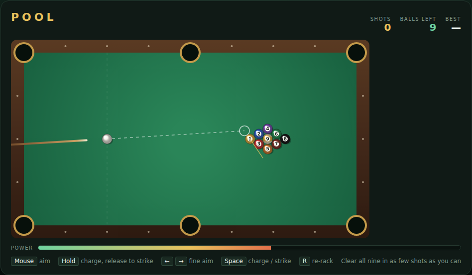

# Pool

A solo nine-ball rack on an HTML5 canvas. Nine numbered balls, six pockets, one
cue ball — clear the table in as few shots as you can.



## How to play

Open `index.html` in a browser and press **Space** (or click **Break**).

Aim by moving the mouse: the cue lines up from the cue ball toward the pointer,
and a dashed guide shows where the cue ball is headed, with a ghost ball marking
the contact point and a gold line showing which way the object ball would be
sent. Hold the mouse button (or **Space**) to fill the power bar, then release
to strike.

Sink all nine object balls to clear the rack. Every stroke counts, so the score
is your **shot count** — lower is better. Pocketing the cue ball is a
**scratch**: it costs one extra shot and the cue ball goes back on the head
spot. Your fewest-shots clearance is saved in the browser as your personal best.

A tidy run with the ghost-ball guide lands somewhere in the twenties; flailing
at the rack will take you well past a hundred.

## Controls

| Input | Action |
|---|---|
| Mouse move | Aim |
| Mouse press & hold | Charge the shot |
| Mouse release | Strike |
| `←` `→` | Nudge the aim by 2° |
| `Shift` + `←` `→` | Fine aim, 0.4° |
| `Space` (hold) | Charge; release to strike |
| `Space` | Start a rack / rack again after a win |
| `R` | Re-rack |

## Rules

- Any ball in any pocket is legal — there are no call shots and no
  lowest-ball-first requirement.
- The only foul is a scratch, which costs a one-shot penalty.
- The rack ends when all nine object balls are down.

## How it works

See [DESIGN.md](DESIGN.md) for the physics model, the state machine and the
assumptions behind the ruleset.

## Tests

```powershell
npx playwright test Pool/tests/
```

66 Playwright specs cover the rack layout, aiming and power, the collision and
cushion physics (including that balls never tunnel out of the table or end up
overlapping), pocketing and scratches, the win flow and personal best, and the
rendering.
