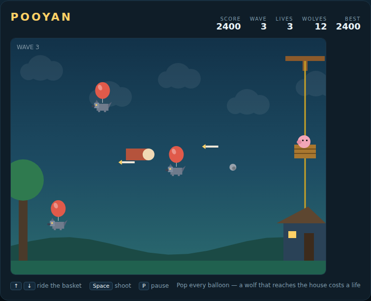

# Pooyan

A mother pig defends her house from a pack of wolves floating in on balloons.
Ride the basket up and down the rope, match a wolf's height, and put an arrow
through its balloon before it reaches the house.



## Playing

Open `index.html` in any browser. No build step and no server — the whole game
is one canvas and one script.

## Controls

| Input | Action |
|---|---|
| `↑` / `W` | Ride the basket up |
| `↓` / `S` | Ride the basket down |
| `Space` | Fire an arrow (also starts the game) |
| `Enter` | Start / resume |
| `P` | Pause |

## How it works

* **Pop the balloons.** An arrow that meets a wolf at the same height drops it
  out of the sky for **100 points**. Only three arrows can be in flight at
  once, so wild firing leaves you empty when a wolf drifts in close.
* **Don't let them through.** A wolf that crosses the screen reaches the house
  and **costs a life**. It still counts towards the wave, so a wave can always
  be finished.
* **Watch for rocks.** Wolves throw rocks back along their own flight line. A
  rock that hits the basket costs a life; shoot one down for **25 points**.
* **Use the meat.** Once a wave is half over, a joint of meat drifts across the
  middle of the screen. Shoot it and it drops, sweeping every wolf in that
  column for **200 points** each. It is the only way to clear a crowded sky in
  one shot — and if you let it float past, that's it for the wave.
* **Clear the wave.** Every wolf in the wave's quota must be resolved — popped,
  swept, or lost through the wall. Clearing one is worth **500 points**, and
  the next wave sends more wolves, faster.

Three lives, and the best score is kept in your browser between sessions.

## Tests

The Playwright suite drives the simulation directly rather than through the
animation loop, so it is deterministic:

```powershell
npx playwright test Pooyan/tests/
```

See [DESIGN.md](DESIGN.md) for how the code is put together, including the
seeded RNG and the switches the tests use to isolate each subsystem.
