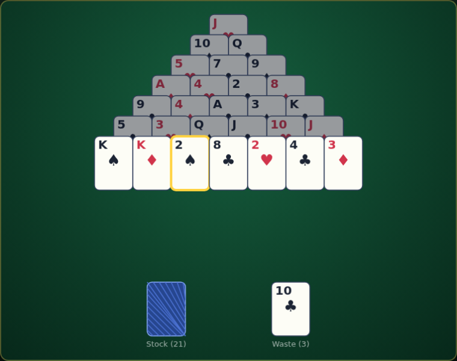

# Pyramid Solitaire

Clear a seven-row pyramid of cards by removing pairs that add up to **13**.
A canvas rendition of the classic patience game.



## How to play

Twenty-eight cards are dealt in a pyramid; each card half-covers two cards
in the row below. A card is **playable** only while it is *exposed* —
nothing overlaps it from below. The bottom row starts fully exposed;
clearing the two cards covering a card exposes it in turn.

Remove cards in **pairs that sum to 13**:

```
A + Q     2 + J     3 + 10     4 + 9     5 + 8     6 + 7     K (alone)
```

- **Click** an exposed card to select it, then click a matching exposed
  card to remove the pair.
- A **King** (13) is removed on a single click — it needs no partner.
- Click the **stock** (bottom-left) to deal its top card to the **waste**;
  the waste top can pair with an exposed pyramid card. When the stock is
  empty, click it to recycle the waste and go through it again.
- Clear all 28 pyramid cards to win.

Score **+5** per pyramid card removed and a **+100** bonus for clearing the
pyramid. Your best score is saved in `localStorage`.

## Controls

| Input | Action |
|---|---|
| Click a card | Select it / remove a King |
| Click a matching card | Remove the pair (sums to 13) |
| Click the stock | Deal to the waste (or recycle when empty) |
| `N` / New Game | Deal a fresh pyramid |

## Running

Open `index.html` directly in any modern browser — no build step or server
required.

## Tests

Playwright tests live in `tests/`. From the repo root:

```powershell
npx playwright test PyramidSolitaire/tests/
```

See [DESIGN.md](DESIGN.md) for how the code works.
