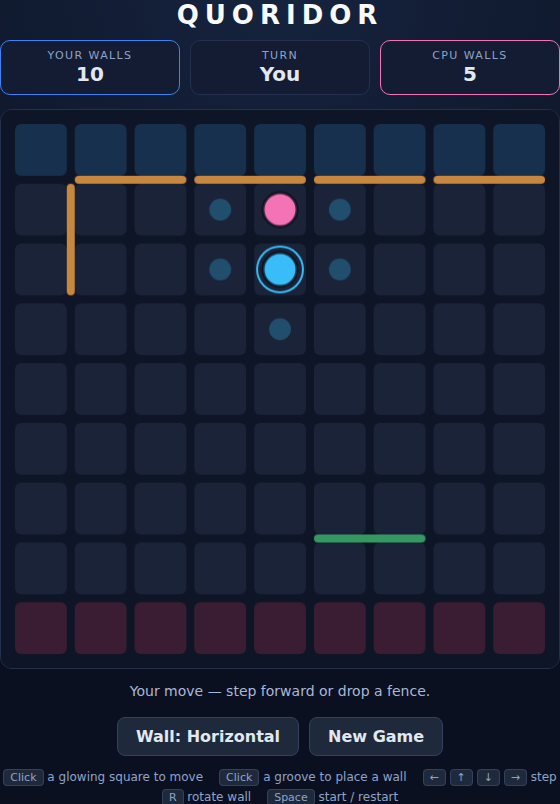

# Quoridor

The classic fence-and-pawn race, built with plain HTML5 canvas and JavaScript —
no build step, no dependencies. Get your pawn to the far side of a 9×9 board
before the computer gets to yours, using ten fences to make its journey longer
than your own.



## How to play

Open `index.html` in any modern browser. Press **Space** (or click **Start
Game**) to begin. You are the blue pawn on the bottom row and win by reaching
**any square of the top row**; the computer is the pink pawn racing the other
way.

Each turn, do **one** of two things:

| Input | Action |
|---|---|
| Click a glowing square | Step your pawn there |
| Click a groove between cells | Drop a fence there |
| ← ↑ → ↓ / WASD | Step one square |
| R or right-click | Rotate the fence (horizontal ↔ vertical) |
| Space | Start / restart |

- **Fences** are two cells long and block movement across the groove they sit
  in. You have ten; so does the computer. The counter at the top shows what's
  left.
- A fence may **never trap a pawn**: if a placement would leave either pawn with
  no route at all to its goal row, it is rejected. The preview under your
  pointer turns green when a fence is legal and red when it isn't.
- **Jumping**: if the two pawns end up face to face, you hop straight over your
  opponent. If a fence or the board edge is behind them, you step diagonally
  around them instead. The arrow keys handle both automatically.
- Fences are a finite resource — spending one is a turn you didn't spend
  running, so the game is a constant trade between blocking and advancing.

## Development

Quoridor follows the repo-wide test setup. From the repository root:

```powershell
npm install
npx playwright install chromium
npx playwright test Quoridor/tests/
```

See [DESIGN.md](DESIGN.md) for how the rules are modelled, how the computer
opponent picks its move, and how the code is kept deterministic for testing.
