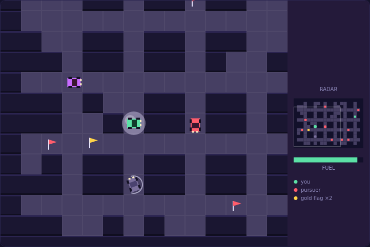

# Rally Chase

A scrolling maze-driving game on an HTML5 canvas. You drive a rally car around a
walled circuit larger than the screen, collecting ten flags while a pack of
pursuit cars hunts you down. The view scrolls to follow you; the radar panel on
the right shows the whole circuit — every flag you have not taken, every pursuer,
and where you are between them.



## Playing

Open `index.html` in any modern browser. No build step and no server required.

## Controls

| Input | Action |
|---|---|
| `←` `→` `↑` `↓` / `W` `A` `S` `D` | steer |
| `Space` | drop a smoke puff (also starts the game when idle or after game over) |
| `Enter` | start / restart |
| `P` | pause / resume |

Steering is remembered: press a direction early and the car takes the turn at
the next corner where it is open, so you do not have to hit corners
frame-perfectly. Reversing works anywhere in a corridor.

## How to play

**Take all ten flags.** They are scattered across the circuit and each is worth
100 points. Collect every one to clear the level and move on to a new circuit.

Two of the flags are not plain:

| Flag | Effect |
|---|---|
| gold — special | doubles the value of every flag you take afterwards, up to ×4 |
| green — fuel | puts 40 units back in the tank |

The multiplier resets each level, so the gold flag is worth chasing **first** —
taken early it is worth eight more flags at double value; taken last it is worth
nothing extra.

**Watch the tank.** Fuel drains the whole time you drive — about 45 seconds on a
full tank. Running dry does not end the run, it drops you to 55% speed, which is
slower than the pursuit cars. From there you are usually not getting away, so
treat the gauge under the radar as the real clock. Clearing a level pays 10
points for every unit still in the tank.

**Use smoke.** Tapping `Space` drops a cloud behind you for 6 fuel. Any pursuer
that drives through it spins out for three seconds — harmless, motionless, and
worth 200 points. One puff can catch several cars at once, which is the best
scoring play in the game, but every puff is fuel you are not driving on.

**Losing a life** costs you the car, not the level: the flags you have already
collected stay collected, everyone returns to their starting cell, and the tank
is refilled. Three lives, and the best score is kept between sessions.

## Difficulty

Each level generates a new circuit and adds pressure:

| | Level 1 | Level 4+ |
|---|---|---|
| pursuit cars | 3 | 6 (cap) |
| pursuer speed | 84 px/s | rising 6 px/s per level, capped at 110 |

Your car does 120 px/s with fuel in it, and the pursuer cap is 92% of that — so
a fuelled car can always outrun them. The danger is never their raw speed; it is
being cornered, or being empty.

## Testing

From the repository root:

```powershell
npx playwright test RallyChase/tests/
```

The suite drives the simulation deterministically through `step(dt)` rather than
waiting on wall-clock time, and covers the circuit generation, driving and
camera, flags and scoring, fuel, smoke, pursuit, level flow, pause and
rendering.
