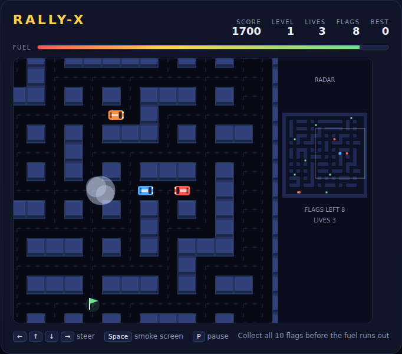

# Rally-X

A top-down maze chase built with plain HTML5 canvas and JavaScript — no build
step, no dependencies. You drive the blue rally car through a scrolling maze
collecting ten flags while red pursuit cars hunt you down. You have no gun:
your only weapon is a smoke screen that spins out any chaser who drives into
it — and it burns the same fuel you need to finish the level.

Inspired by Namco's *Rally-X* (1980).



## How to play

Open `index.html` in any modern browser. Press **Space** (or click **Start
Game**) to begin.

| Input | Action |
|---|---|
| <kbd>←</kbd> <kbd>→</kbd> <kbd>↑</kbd> <kbd>↓</kbd> or <kbd>W</kbd><kbd>A</kbd><kbd>S</kbd><kbd>D</kbd> | Steer |
| <kbd>Space</kbd> | Drop a smoke screen |
| <kbd>Enter</kbd> | Start / restart |
| <kbd>P</kbd> | Pause |

Steering is forgiving: press a direction before the junction and the car takes
it as soon as the turn becomes legal.

## Rules

- Collect all **ten flags** to clear the level. The maze is bigger than the
  screen — the **radar** panel on the right shows the whole map: green pips are
  flags, red pips are chasers, the blue pip is you, and the box is the part of
  the maze you can currently see.
- One flag in each level is the **special flag**, marked with an **S** and
  drawn in gold. From the moment you take it, every remaining flag in that
  level is worth **double** — so fetching it early is worth the detour.
- **Chasers** are slower than you but never stop hunting, and they get quicker
  each level. Touching one costs a life.
- **Smoke** costs fuel. Any chaser that drives into a cloud spins out for a
  few seconds and scores 200.
- **Fuel** drains as you drive. An empty tank costs a life, so a level you
  cannot finish in time is a level you lose.
- Clearing a level pays a bonus of **10 points per unit of fuel left** in the
  tank, then hands you a fresh maze with one more chaser in it.

## Scoring

| Event | Points |
|---|---|
| Flag | 100 (200 after the special flag) |
| Chaser caught in smoke | 200 |
| Fuel left at level clear | 10 each |

Your best score is kept in `localStorage`.

## Files

| File | Contents |
|---|---|
| `index.html` | Page shell: HUD, fuel gauge, canvas and overlay |
| `style.css` | Styling for the cabinet around the canvas |
| `game.js` | The whole game: maze generation, driving, chasers, drawing |
| `DESIGN.md` | How the code works and what was assumed while building it |
| `tests/rallyx.spec.js` | Playwright specs covering the rules above |

## Tests

From the repository root:

```powershell
npx playwright test RallyX/tests/
```
