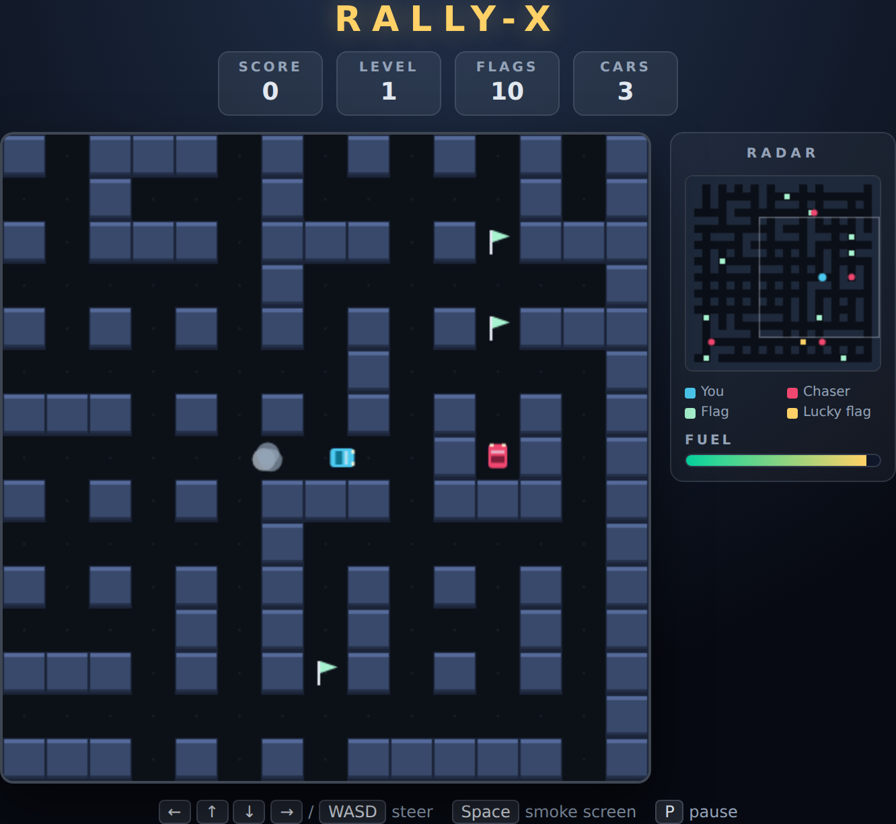

# Rally-X

A scrolling maze rally. Drive the blue car around a circuit four times the size
of the screen, collect all **ten flags**, and stay ahead of the red chasers.
You have no weapon — only a **smoke screen** that spins out anything that drives
into it, and a **radar** showing the whole course at a glance.



## How to play

Open `index.html` in a browser. No build step and no server required.

| Input | Action |
|---|---|
| Arrow keys / `WASD` | Steer |
| `Space` | Drop a smoke screen (costs 5 fuel) |
| `Space` / `Enter` / **Start Game** | Begin, or race again after game over |
| `P` | Pause / resume |

## Rules

- **Flags.** Ten per circuit, worth 100 points each. Exactly one is the **lucky
  flag**, drawn in gold on the track and on the radar: it scores 100 like any
  other, but every flag you take *after* it in that circuit is worth 200. Take
  all ten to clear the level.
- **Chasers.** Red cars that hunt you through the maze. They are slower than you
  in a straight line, so you lose by being cornered, not outrun. Touching one
  wrecks your car. Four of them on level 1, one more each level up to six, and
  a little faster every level.
- **Smoke.** Space leaves a cloud on the road behind you for 5 fuel. A chaser
  that drives into it spins out for about two and a half seconds — while it is
  spinning it cannot move and cannot hurt you, so you can drive straight past.
- **Fuel.** The tank drains as you drive and every smoke screen costs more.
  Running dry does not kill you: the car drops to half speed and can no longer
  make smoke, which usually amounts to the same thing shortly afterwards.
  Clearing a level refills the tank and pays 10 points per litre left.
- **Cars.** You start with three. Losing the last one ends the game. A wreck
  sends everything back to its starting tile, but the flags you have already
  collected stay collected — and the tank is *not* refilled.

## Reading the radar

The panel on the right is the whole 24 × 24 circuit at a glance: walls in slate,
your car in blue, chasers in red, flags in green and the lucky flag in gold. The
pale rectangle is the slice of the world currently on screen. Planning a route
that sweeps up flags without driving into a pack of chasers is the real game —
the main view alone never shows you enough to do it.

## Files

| File | What it holds |
|---|---|
| `index.html` | Markup: HUD, the 480 × 480 viewport, the radar panel and the overlay |
| `style.css` | All presentation |
| `game.js` | Maze generation, driving, chaser AI, smoke, scoring and rendering |
| `DESIGN.md` | How the code works, and the assumptions behind the rules |
| `tests/rally-x.spec.js` | Playwright suite (77 tests) |

## Tests

From the repository root:

```powershell
npx playwright test RallyX/tests/
```
