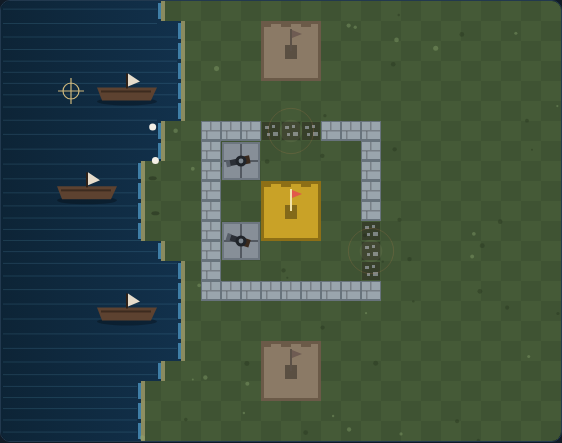

# Rampart

A siege game on an HTML5 canvas. You hold a castle on the coast; a fleet stands
off the shore and shells your walls. Between bombardments you are handed wall
pieces and have to draw a closed ring again — because when the round ends, the
sea floods in through any gap, and a castle it can reach is lost.



## Playing

Open `index.html` in any modern browser. No build step and no server required.

## Controls

| Input | Action |
|---|---|
| Mouse move | move the cursor |
| Left click | place a cannon / fire / place a wall piece |
| Right click | rotate the wall piece |
| `←` `↑` `↓` `→` / `WASD` | move the cursor |
| `Space` | act at the cursor (also starts the game when idle or after game over) |
| `R` | rotate the wall piece |
| `P` | pause / resume |

## How to play

Every round runs through the same three phases. The clock in the HUD tells you
which one you are in and how long it has left.

**Place cannons (10 s).** The ground you enclose is tinted. Drop 2 × 2 cannons on
it — you get two, plus one for every castle you currently hold. The cursor shows
green where a cannon fits and red where it does not. Cannons stay on the board
between rounds, so a quiet round builds a battery.

**Battle (30 s).** Ships sail in from the west and anchor off the coast. Their
guns stay quiet while they are still out at sea and open up over the last stretch
of the run in — that approach is your window. Click a ship and *every* loaded
cannon in range fires at that point at once; a sinking is worth 200 points. Ships
that live long enough start shelling, and each shell blows a small crater in your
stonework — and in any cannon it lands on.

From round 4 the fleet arrives armoured and takes more than one ball to sink, and
the ships come thicker and faster the longer you hold out.

Your own shells destroy your own walls too. Firing across your ramparts at
something just behind them will punch a hole in your own ring, so pick targets in
open water where you can.

**Repair (25 s, shorter every round).** You are dealt wall pieces one at a time,
tetromino-shaped, with the next one shown in the corner. Place them on open land
to close the holes; the grey rubble marks show you exactly where the wall used to
be. Pieces cannot overlap anything already standing, so a one-cell pinhole either
waits for the single-cell piece or gets bypassed with a small bulge around it.

**The checkpoint.** When the repair clock runs out the board floods from its
edges. Every castle the flood cannot reach survives and pays 150 points; the
round counter ticks up and the fleet comes back larger. If the flood reaches all
three castles, the siege is over.

## Strategy

- **Sink ships early.** Damage you prevent is repair time you keep. The window
  between a ship anchoring and its first shot is the most valuable few seconds in
  the round.
- **Shrink, don't sprawl.** A tight ring around one castle takes about sixteen
  cells to close. If the round went badly, abandon the outer wall and draw a
  small ring you can actually finish.
- **Then sprawl.** Once you are comfortable, wall in a second castle: it pays a
  bonus every round *and* grants another cannon each placement phase.
- **Watch the water.** Enclosed sea is enclosed, but you cannot build a cannon on
  it. A ring drawn out over a bay holds a castle but gives you nowhere to put
  guns.

## Development

Tests live in `tests/` and run with Playwright from the repo root:

```powershell
npx playwright test Rampart/tests/
```

See [DESIGN.md](DESIGN.md) for how the code is put together.
