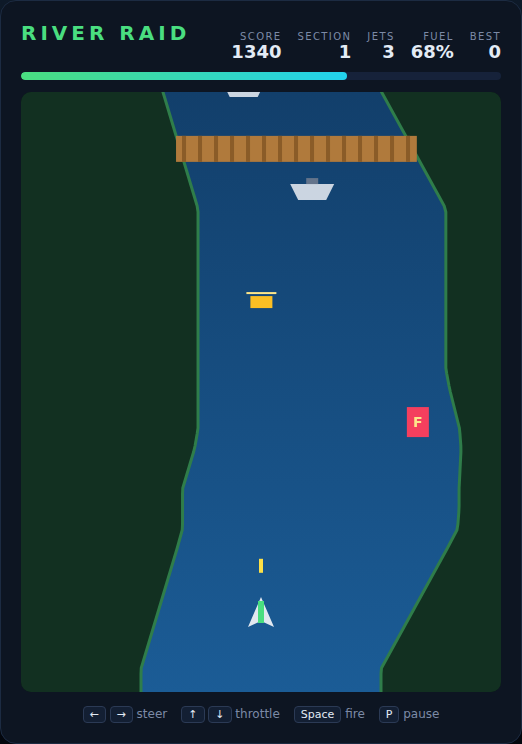

# River Raid

Fly a jet up an endless winding river. Shoot what you can, refuel where you must,
and blow the bridge to open the next section.



## Playing

Open `index.html` in any browser — no build step, no server.

## Controls

| Input | Action |
|---|---|
| `←` / `→` (or `A` / `D`) | steer left / right |
| `↑` / `↓` (or `W` / `S`) | throttle up / down |
| `Space` | fire |
| `Space` / `Enter` | start, or play again |
| `P` | pause / resume |

## How it works

- The river is generated as you fly, so no two runs are the same. Its banks
  narrow and meander — touch one and you lose a jet.
- Your **fuel** drains constantly. Fly over the red `F` depots to refuel. Run dry
  and you lose a jet.
- Depots are worth 80 points if you shoot them, so every depot is a choice:
  points now, or fuel for later.
- Only **one missile** can be in the air at a time. Make it count.
- A **bridge** closes each section of the river. It blocks the channel, so it must
  be destroyed — worth 500 points, and it advances you to the next section.
- Each section flies faster and carries more traffic.
- You get three jets. Your best score is saved in the browser.

## Scoring

| Target | Points |
|---|---|
| Ship | 30 |
| Helicopter | 60 |
| Fuel depot | 80 |
| Enemy jet | 100 |
| Bridge | 500 |

## Tests

```powershell
npx playwright test RiverRaid/tests/
```

See [DESIGN.md](DESIGN.md) for how the code is put together.
