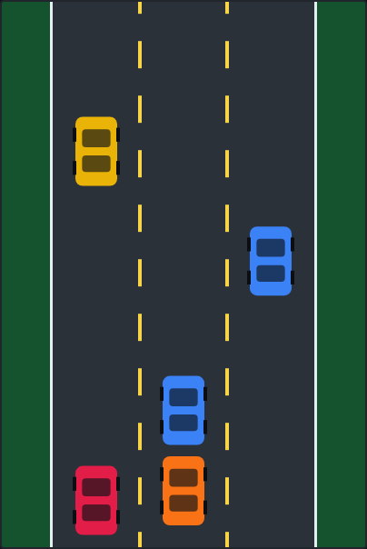

# Road Racer

A top-down highway-dodging arcade game. Weave your car through three lanes of
oncoming traffic. The road speeds up the longer you survive — one crash ends
the run.



## How to play

- **Steer** with `←` / `→` (or `A` / `D`).
- **Start / restart** with `Space`, any steering key, or the on-screen button.
- **Pause / resume** with `P`.

Your score is the distance you cover; it climbs faster as the road accelerates.
Your best score is saved in the browser (`localStorage`).

## Running

Open `index.html` directly in any modern browser — no build step or server
required.

## Development

Tests are written with [Playwright](https://playwright.dev). From the repo root:

```powershell
npm install
npx playwright install chromium
npx playwright test RoadRacer/tests/
```

See [DESIGN.md](DESIGN.md) for the mechanics, state machine, and the
assumptions made while building the game.
