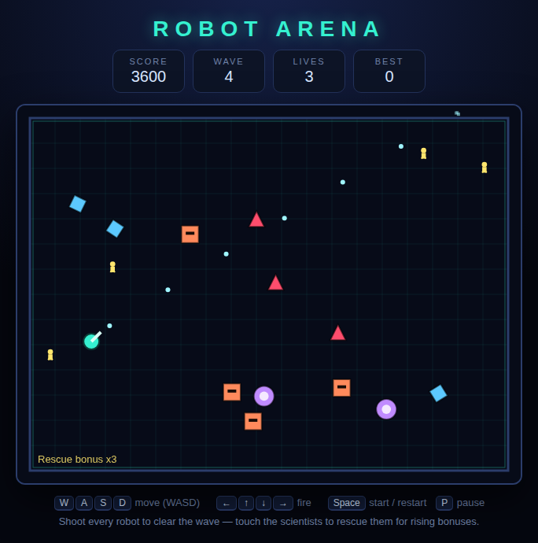

# Robot Arena

A twin-stick arena shooter on an HTML5 canvas. Walk with one hand, shoot with
the other, clear every robot in the wave — and rescue the scientists while
you're at it.



## Playing

Open `index.html` in any modern browser. No build step, no server.

## Controls

| Input | Action |
|---|---|
| `W` `A` `S` `D` | Move |
| `↑` `↓` `←` `→` | Fire (independent of movement) |
| `Space` | Start / restart |
| `P` | Pause / resume |

## How it works

- Every wave drops a fresh pack of robots and a few wandering scientists into
  the arena.
- Shoot every robot to clear the wave. A short breather, then the next wave
  arrives — bigger, faster, and with meaner machines in the mix.
- Touch a scientist to rescue them. The first rescue in a wave is worth 100,
  the second 200, the third 300, and so on up to 1000. The chain resets each
  wave, so sweeping them up in one run is worth far more than picking at them.
- Any contact with a robot, or with a sentry's shot, costs one of your three
  lives. You respawn in the centre with a couple of seconds of shield.

## The robots

| Robot | Look | Behaviour | Points |
|---|---|---|---|
| Grunt | Orange box | Marches straight at you | 100 |
| Sentry | Purple sphere | Shoots back, takes two hits | 150 |
| Drifter | Blue diamond | Ricochets off the walls at speed | 125 |
| Hunter | Red triangle | Fast, and aims where you're heading | 200 |

Grunts show up from wave 1, sentries and drifters from wave 2, hunters from
wave 3.

## Scoring

Points come from destroyed robots and rescued scientists. Your best run is
saved in the browser's local storage and shown as **Best** in the HUD.

## Tests

```powershell
npx playwright test RobotArena/tests/
```

61 Playwright tests cover movement, shooting, each robot's behaviour, damage
and invulnerability, rescues, wave progression, pausing, and game over. See
[DESIGN.md](DESIGN.md) for how the code is put together.
