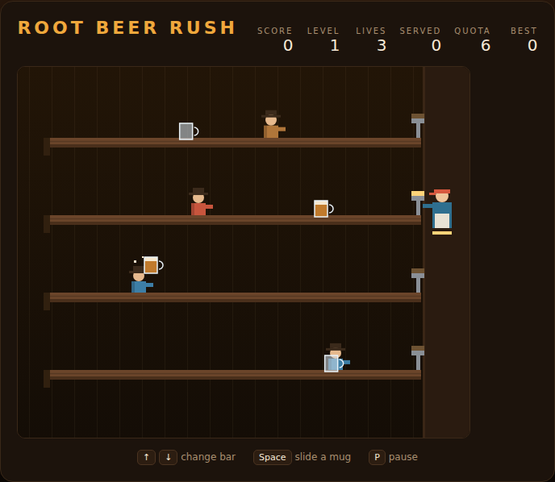

# Root Beer Rush

Four bars. One barkeep. A saloon full of people who want root beer *now*.



Patrons shuffle in from the far end of each bar and walk toward you. Slide a mug
down their lane to shove them back, and keep shoving until they leave happy.
Every patron who stops for a drink slides the empty mug back — be standing in
that lane to catch it.

## How to play

Open `index.html` in a browser. No build step, no server.

| Key | Action |
|---|---|
| <kbd>↑</kbd> / <kbd>W</kbd> | Move up one bar |
| <kbd>↓</kbd> / <kbd>S</kbd> | Move down one bar |
| <kbd>Space</kbd> | Slide a mug down the current bar |
| <kbd>P</kbd> | Pause / resume |

Press <kbd>Space</kbd> or click **Start Game** to begin.

## Rules

- **Serve patrons.** A mug that reaches a walking patron pushes them back down
  the bar. Push one past the far end and they leave satisfied — that counts
  toward the level's quota.
- **Catch the empties.** A patron who drinks mid-bar slides the empty mug back.
  Catch it by standing in that lane; miss it and it smashes.
- **Don't waste mugs.** A mug that reaches the far end of an empty bar drops off
  the end.
- **Don't get cornered.** A patron who reaches your end of the bar costs a life.

You have three lives. Smashed empties, dropped mugs and patrons who reach you
each cost one.

## Scoring

| Event | Points |
|---|---|
| Mug delivered | 50 |
| Patron served | 100 |
| Empty caught | 25 |
| Level cleared | 250 × level |

Each level asks for more patrons than the last, and they arrive faster and walk
quicker. Your best score is remembered in the browser.

## Development

See [DESIGN.md](DESIGN.md) for how the code is put together and the assumptions
behind the rules.

```powershell
npx playwright test RootBeerRush/tests/
```
