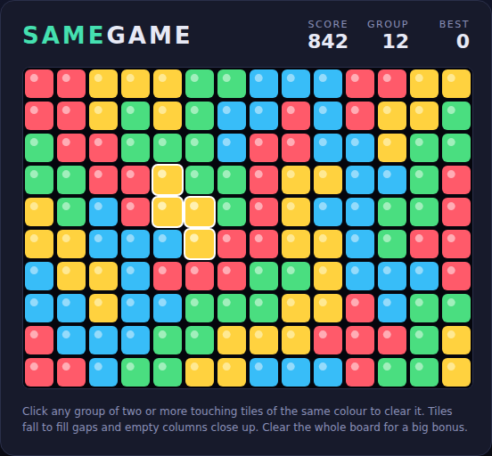

# SameGame

A browser build of the classic tile-clearing puzzle **SameGame** (a.k.a. *Chain
Shot!*), in plain HTML5 canvas and JavaScript. No build step or server — just
open `index.html`.



## How to play

The board is packed with coloured tiles. **Click any group of two or more
touching tiles of the same colour** (touching up/down/left/right) and the whole
group disappears. Tiles above the gap fall down, and any column that becomes
completely empty closes up as the columns to its right slide left.

Bigger groups are worth far more, so the game is about *ordering*: merge little
blobs into big ones before you clear them. The game ends when no group of two or
more is left — and clearing the **entire board** earns a **1000-point bonus**.

Hover a group to highlight it and preview how many points it would score (shown
under **Group** in the header).

### Controls

| Input | Action |
|---|---|
| Hover a tile | Highlight its group and preview the score |
| Click a group of 2+ | Clear it |
| Start button / any key | Begin a new game |
| Play Again | Deal a fresh board after the game ends |

### Scoring

Removing a group of `n` tiles scores `n × (n − 1)` points — 2 tiles → 2,
3 → 6, 4 → 12, 5 → 20, 10 → 90 — so a single big group beats several small ones.
Clearing every tile adds a 1000-point bonus. Your best score is saved in the
browser.

## Development

See [`DESIGN.md`](DESIGN.md) for how the code is organised. The logic lives in
`game.js` and is exposed as globals so the Playwright suite in `tests/` can drive
and inspect it deterministically.

Run the tests from the repository root:

```bash
npx playwright test SameGame/tests/
```
