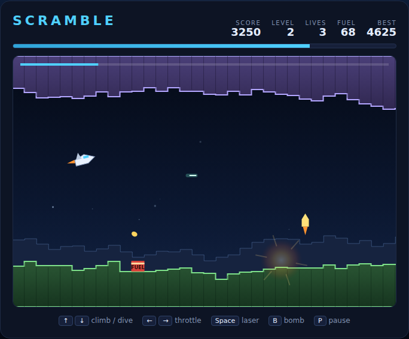

# Scramble

A side-scrolling cave flyer on an HTML5 canvas. Your jet is dragged forward
through a procedurally generated canyon at a fixed speed — you only choose where
inside the canyon to sit. Fuel drains the whole time and the only way to top it
up is to blow up the fuel dumps sitting on the canyon floor, so every run is a
trade between flying the safe line and diving low enough to bomb the tanks that
keep you airborne.



## Playing

Open `index.html` in any modern browser. No build step and no server required.

## Controls

| Input | Action |
|---|---|
| `↑` `↓` / `W` `S` | climb / dive |
| `←` `→` / `A` `D` | throttle back / forward within your window on screen |
| `Space` | fire the laser (also starts the game when idle or after game over) |
| `B` | drop a bomb |
| `Enter` | start / restart |
| `P` | pause / resume |

## How to play

**Fly the corridor.** The canyon scrolls past on its own and gets faster every
level. From level 2 the cave grows a roof, so the flyable gap narrows to a
corridor you have to thread. Touching rock costs a life.

**Watch the gauge.** A full tank lasts a little over half a minute — just about
one clean run through level 1, with nothing to spare. The bar under the HUD turns
amber, then red, as it empties; running dry costs a life just as surely as a wall
does.

**Bomb the dumps.** Each red `FUEL` tank on the floor is worth 100 points and 15
units of fuel. Bombs keep your forward momentum and then arc down, so aim well
ahead of the target — the faster you are going and the higher you are flying, the
further ahead you must release. Up to three bombs can be in the air at once.

**Shoot the rockets.** Rockets stand on the floor until you get within a couple of
hundred pixels, then lift off straight up into your flight path. Shoot one for 80
points, or climb over it — but do not let it reach you, because touching one is
fatal. Up to four laser shots at a time; they are stopped by rock, so a shot into
a rising wall is wasted.

**Clear the canyon.** Fly the full length of a level for 500 points plus 5 per
unit of fuel still in the tank, then a fresh, faster canyon is generated. You have
three lives; a crash restarts the current level from its opening safe strip with a
full tank.

## Scoring

| Event | Points |
|---|---|
| Fuel dump destroyed | 100 (+15 fuel) |
| Rocket destroyed | 80 |
| Level cleared | 500 + 5 × remaining fuel |

Your best score is remembered in `localStorage`.

## Development

`DESIGN.md` explains the terrain generator, the camera and flight model, the
weapon arcs and the level/crash flow, and records the assumptions made while
building it.

Tests are Playwright specs in `tests/`:

```powershell
npx playwright test Scramble/tests/
```

All game motion is expressed per-second and advanced through `step(dt)`, so the
specs simulate frames deterministically rather than waiting on wall-clock time.
