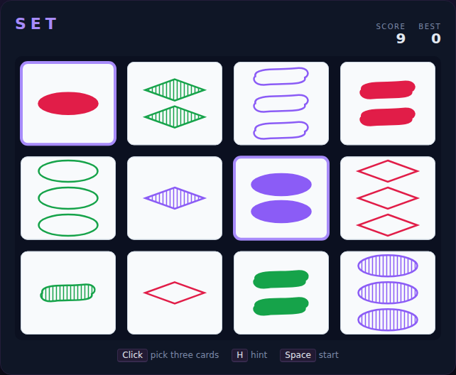

# Set

The classic real-time pattern game, built with plain HTML5 canvas and
JavaScript — no build step, no dependencies. Twelve cards are on the table.
Every card has four attributes — **count** (1–3), **colour** (red / green /
purple), **shape** (oval / diamond / squiggle) and **shading** (solid / striped
/ open). A **Set** is any three cards where each attribute, on its own, is
either all the same or all different across the three. Spot Sets as fast as you
can!



## How to play

Open `index.html` in any modern browser. Press **Space** (or click the board /
**Start Game**) to begin, then click three cards you believe form a Set.

| Key / input | Action |
|---|---|
| Click / tap a card | Toggle its selection (a third pick is checked) |
| Space / Enter | Start / restart the game |
| H | Highlight one valid Set (hint) |

- A valid Set scores points, is cleared away, and — while the deck lasts — is
  replaced with fresh cards.
- A wrong trio costs a small penalty (your score never drops below zero).
- If the twelve cards happen to hold no Set, three more are dealt automatically,
  so you can never get stuck.
- The game ends when the deck is empty and no Set remains — ideally with every
  card paired away. Your best score is saved in the browser's `localStorage`.

### What counts as a Set?

For each of the four attributes, the three cards must be **all identical** or
**all distinct**. For example, three cards that are all red, all ovals, all
solid, but showing 1, 2 and 3 shapes are a valid Set (three attributes all-same,
one all-different).

## Development

Set follows the repo-wide test setup. From the repository root:

```powershell
npm install
npx playwright install chromium
npx playwright test SetGame/tests/
```

See [DESIGN.md](DESIGN.md) for how the code is structured and how the rule logic
is made deterministic for testing.
