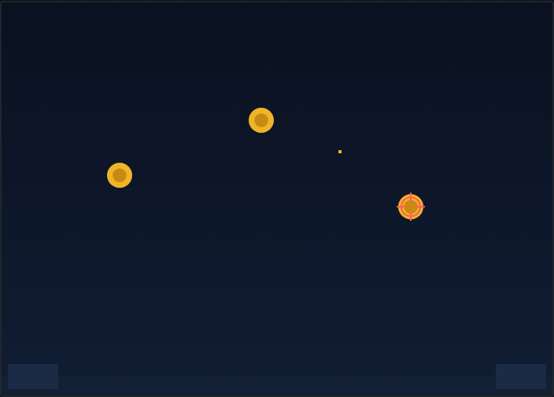

# Skeet Shooter

A clay-pigeon shooting gallery, built with HTML5 Canvas. Clays are flung across
the range under gravity — swing your crosshair with the mouse and click to
shatter them before they escape.

## How to Play

Open `index.html` in any modern browser — no build step, no dependencies.

| Input | Action |
|---|---|
| Move the mouse | Aim the crosshair |
| Left-click | Fire |
| P | Pause / resume |
| Click, Space, Enter, or the button | Start or restart |

**Objective:** Shatter the flying clays. Each hit is a point. A clay that flies
off the screen without being shot is a **miss** — rack up **5 misses** and the
round is over.

**Aiming:** A shot connects if your click lands within a small tolerance of a
clay's edge, and a single shot takes out at most one clay (the closest one), so
you can't clear a cluster with one trigger pull. Wasted clicks on empty sky cost
you nothing but a point you didn't score.

**Difficulty:** The clays come faster the higher your score climbs, so a hot
streak quickly gets frantic.

**Best:** Your highest score is saved in `localStorage`, so your personal best
persists between sessions.

See [DESIGN.md](DESIGN.md) for how the code works.
