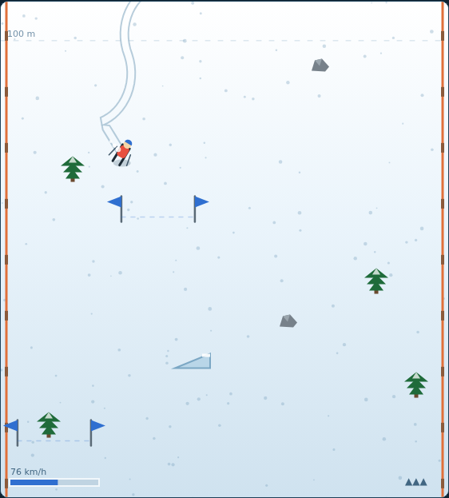

# Ski Slalom

An endless downhill ski run on an HTML5 canvas. The camera looks straight down
the fall line — you hold a fixed height on screen while the mountain scrolls up
past you. Thread the slalom gates for points, dodge the trees and rocks, launch
off the ramps, and see how far down the hill you get before three crashes finish
the run.



## Playing

Open `index.html` in any modern browser. No build step and no server required.

## Controls

| Input | Action |
|---|---|
| `←` `→` / `A` `D` | carve left / right |
| `↓` / `S` | snowplough brake |
| `Space` | jump (also starts the game when idle or after a wipeout) |
| `Enter` | start / restart |
| `P` | pause / resume |

## How to play

**Carving is the whole game.** Your steering angle controls two things at once.
Point straight down the fall line and you accelerate toward the top speed, but
you barely move sideways. Carve hard across the hill and you cross the piste
fast — while your speed drops away to almost nothing. Every gate is a small
decision about how much pace you are willing to trade for position.

**Gates.** Each blue flag pair is a gate. Ski between the flags and you score,
and the flags turn green; go round the outside and they turn red. Consecutive
gates build a combo multiplier up to ×8, so a clean run is worth many times a
scrappy one. Missing a gate — or crashing — drops you back to ×1.

**Trees, rocks and ramps.** Trees and rocks end the run in a face full of snow:
each one costs a life, and you have three. `Space` hops you over rocks, but a
tree is far too tall to clear. Ramps fling you into a long flight worth 120
points a second of air time, and you can steer (slowly) while you are up there.

**It gets faster.** The speed cap climbs steadily with every metre descended,
and the course rows tighten from 130 px apart to 78 px. What is a comfortable
line at 200 m is a very busy one at 2000 m.

**Scoring.**

| Source | Points |
|---|---|
| distance | 1 per metre |
| gate | 100 × current combo |
| air time | 120 per second, paid on landing |

Your best score is kept in `localStorage`, so it survives a reload.

## Tests

The Playwright suite lives in `tests/` and covers steering and the speed
trade-off, gate judging and the combo, crashes and lives, jumping and ramps,
course generation and culling, pausing, restarting and rendering.

```powershell
npx playwright test SkiSlalom/tests/
```

See [DESIGN.md](DESIGN.md) for how the code is put together.
