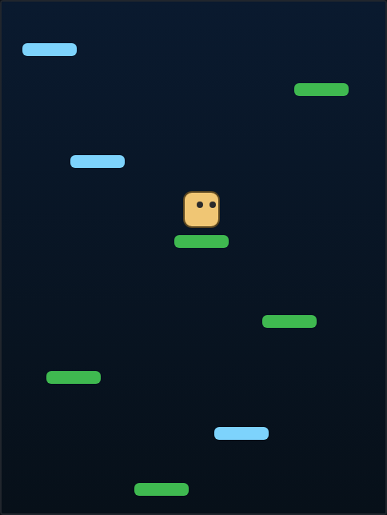

# Sky Climber

An endless vertical platform-jumper built with HTML5 Canvas — bounce ever
higher and don't fall.



## How to Play

Open `index.html` in any modern browser — no build step, no dependencies.

| Input | Action |
|---|---|
| ← / → arrows (or A / D) | Steer left / right |
| P | Pause / resume |
| ← / → / Space / Enter, or the button | Start or restart |

**Objective:** Your hopper bounces automatically off every platform it lands
on — you only steer. Climb as high as you can. The camera follows you upward,
platforms stream past below, and your **height in metres** is your score. Miss
your footing and fall off the bottom of the screen and the run ends.

**Platforms:**

- **Green** platforms sit still.
- **Blue** platforms slide side to side and bounce off the walls, so you have to
  time your landing.

**Wrap-around:** Steer off one side of the screen and you reappear on the other,
so the play-field wraps horizontally.

**Best Height:** Your highest climb is saved to `localStorage`
(`sky-climber-best`) and persists between sessions.

See [DESIGN.md](DESIGN.md) for the concept, mechanics, and how the code works.

## Tests

This game is covered by a Playwright suite in [`tests/`](tests/). From the repo
root:

```powershell
npx playwright test SkyClimber/tests/
```
