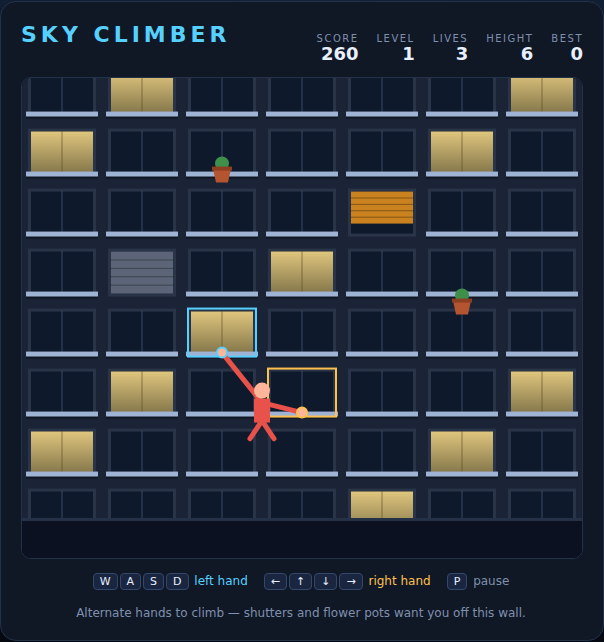

# Sky Climber

A two-handed skyscraper climb on an HTML5 canvas, inspired by *Crazy Climber*.
There is no "move" button: your left hand and your right hand are separate
cursors on a wall of windows, and the only way up is to make them take turns.
Shutters slam closed under your grip and flower pots drop off the roof.



## Playing

Open `index.html` in any modern browser. No build step and no server required.

## Controls

| Input | Action |
|---|---|
| `W` `A` `S` `D` | move the **left** hand up / left / down / right |
| `↑` `←` `↓` `→` | move the **right** hand up / left / down / right |
| `Space` / `Enter` | start (also restarts after game over) |
| `P` | pause / resume |

## How to play

**Alternate your hands.** Each key press moves one hand exactly one window. The
hands can never be more than one row apart, so a single hand cannot walk up the
wall on its own — reach up with the left, bring the right alongside, repeat.
Height only counts once the trailing hand catches up.

**Travelling sideways needs a stagger.** The left hand must stay left of, or
level with, the right hand, never more than one column apart, and the two hands
can never share a window. So to move across you first offset them by a row, lead
one hand into the other's column, then bring the trailing hand across.

**Watch the shutters.** Any window can start closing: it turns amber and the
shutter comes halfway down for about three quarters of a second, then slams. You
cannot grab a closing or closed window, and if a shutter comes down on a window
you are *holding*, you lose your grip. Shut windows re-open after a few seconds.

**Dodge the pots.** Flower pots are pushed off the roof and fall straight down a
single column. If one reaches a hand, it costs you. Move that hand — or the
whole climber — out of the column.

**Get knocked, slide down.** A shutter or a pot costs one of your three lives and
drops you three rows. You always land on open windows, and you get a moment of
grace before anything can hit you again. At zero lives the climb is over.

**Reach the roof.** Get both hands onto the roof ledge — always shutter-free — to
clear the building. The next building is five rows taller, its shutters come
faster and its pots fall harder.

## Scoring

| Event | Points |
|---|---|
| Each new row of height | 10 |
| Reaching the roof | 500 × building number |

Ground you have already covered pays nothing, so sliding down and re-climbing is
pure loss. Your best score is remembered in `localStorage`.

## Development

`DESIGN.md` explains the movement rules, the hazard timings, the difficulty curve
and the assumptions made while building it.

Tests are Playwright specs in `tests/`:

```powershell
npx playwright test SkyClimber/tests/
```

All game motion is expressed per-second and advanced through `step(dt)`, so the
specs simulate frames deterministically rather than waiting on wall-clock time.
