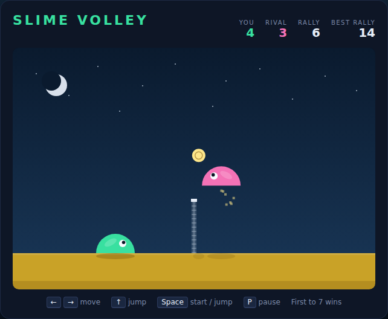

# Slime Volley

A physics volleyball match between two slimes, built with plain HTML5 canvas and
JavaScript — no build step, no dependencies. You are the green slime on the left;
a computer-controlled pink slime defends the right. Keep the ball off your own
sand and land it on theirs. First to **7 points** wins.



## How to play

Open `index.html` in any modern browser. Press **Space** (or click **Start
Match**) to begin.

| Key | Action |
|---|---|
| ← / A | Walk left |
| → / D | Walk right |
| ↑ / W | Jump |
| Space | Start / restart the match — and jump while playing |
| P | Pause / resume |

- A slime is a **dome**, so the angle the ball leaves at depends on where you
  make contact. Meet it on the outside flank for a flat, fast drive; take it dead
  centre for a high lob over the net.
- **Jump into the ball** to add pace, and **walk into it** to add sideways drift —
  both of your slime's velocities are passed on to the ball.
- Neither slime can cross the net, and neither can jump twice without landing
  first.
- The net is solid. Balls can rattle off its side or clip the tape and trickle
  over, so a rally is never quite over until the ball hits the sand.
- The side that **wins a point serves next**: the ball hangs briefly above their
  court, then drops.
- Your longest **rally** of the session is tracked and saved in the browser's
  `localStorage`.

## Development

Slime Volley follows the repo-wide test setup. From the repository root:

```powershell
npm install
npx playwright install chromium
npx playwright test SlimeVolley/tests/
```

See [DESIGN.md](DESIGN.md) for how the physics, the opponent AI and the
deterministic simulation loop are built — and for the assumptions behind the
match rules.
