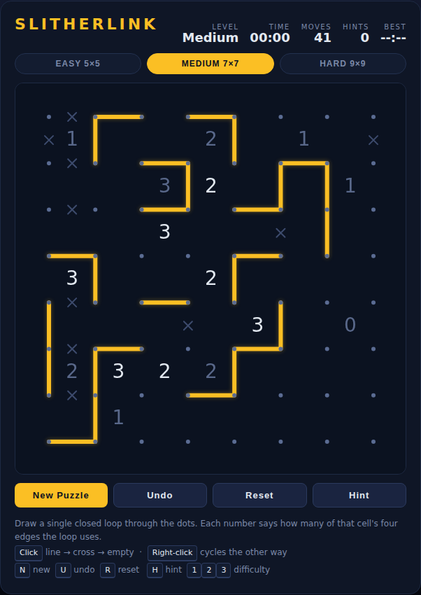

# Slitherlink

A loop-drawing logic puzzle built with plain HTML5 canvas and JavaScript — no
build step, no dependencies. Every puzzle is generated on the fly and verified to
have **exactly one solution**, so it can always be finished by pure deduction.



## How to play

Open `index.html` in any modern browser. A puzzle is dealt immediately.

Draw line segments between neighbouring dots so that the segments form **one
single closed loop** — no branches, no crossings, no second loop. The numbers
tell you how many of that cell's four edges the loop must use:

- **0** — the loop touches none of this cell's four edges
- **3** — the loop uses three of them
- a blank cell — no constraint at all

The puzzle is solved the moment the drawn lines form one closed loop *and* every
number is satisfied. The board locks, the loop turns green and your time is
recorded.

## Controls

| Input | Action |
|---|---|
| Left click on an edge | Cycle it: empty → line → cross → empty |
| Right click on an edge | Cycle the other way: empty → cross → line → empty |
| `N` | New puzzle |
| `U` | Undo the last edge |
| `R` | Clear the board (same puzzle) |
| `H` | Hint — reveal one correct edge |
| `1` / `2` / `3` | Easy 5×5 / Medium 7×7 / Hard 9×9 |

A **cross** marks an edge you have ruled out. It is a note to yourself: it never
counts toward a number and is never required to finish a puzzle.

## Reading the board

- A number dims to grey once exactly the right number of lines surround it.
- A number turns **red** when too many lines surround it — something above is wrong.
- The timer runs from the moment a puzzle appears and stops on the solve. Best
  times are kept per difficulty in `localStorage`.

## Tips

- Start with the `0`s: every edge around them can be crossed off immediately.
- A `3` in a corner always uses both of that corner's outer edges.
- Two diagonally touching `3`s always use the two edges that face away from each
  other — the loop cannot pinch through the shared dot.
- Every dot ends up with exactly **0 or 2** lines. If a dot already has two, cross
  off its other two edges.

## Tests

Playwright specs live in `tests/slitherlink.spec.js` and cover puzzle generation
(including that the generated solution really is one closed loop), edge cycling,
clue feedback, win detection, undo/reset/hints, mouse and keyboard input, and the
timer and best-time persistence.

```powershell
npx playwright test Slitherlink/tests/
```

See [DESIGN.md](DESIGN.md) for how the generator, the uniqueness solver and the
win check work.
