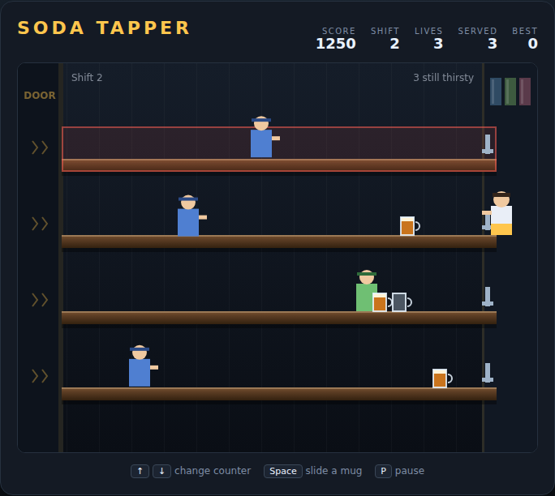

# Soda Tapper

A four-lane bar-service arcade game on an HTML5 canvas, in the spirit of the 1983
coin-op *Tapper*. You are a soda jerk working four bars at once — slide mugs down
the bar to push thirsty customers back toward the door, then get back in position
to catch the empties they send sailing home.



## Playing

Open `index.html` in any browser. No build step, no server.

## Controls

| Input | Action |
|---|---|
| <kbd>↑</kbd> / <kbd>W</kbd> | Move up one bar |
| <kbd>↓</kbd> / <kbd>S</kbd> | Move down one bar |
| <kbd>Space</kbd> | Pour a mug (also starts / restarts the game) |
| Mouse move | Move to the bar under the cursor |
| Click | Pour a mug |
| <kbd>P</kbd> | Pause / resume |

## How it works

Customers walk in through the doors on the left of each bar and head for your
tap. A full mug slid down a bar shoves the nearest customer back and holds them
there while they drink. Push someone all the way back out of the door and they
leave happy — that's a serve. Someone who has walked most of the bar takes three
mugs to clear.

Only one customer works a bar at a time, so the pressure comes from all four
bars going at once — not from a queue on any one of them.

Every mug they drink comes back at you as an empty, so pouring is a commitment:
you have to be standing at that bar when the empty reaches the tap.

**Three ways to lose a life:**

- A customer reaches your tap.
- A full mug slides all the way off the end of a bar with nobody to drink it.
- An empty reaches the tap and you're standing at a different bar.

A mishap also sweeps all loose glassware off the bars, so one slip doesn't
immediately cascade.

## Scoring

| Event | Points |
|---|---|
| Customer served (pushed out of the door) | 10 × wave |
| Empty mug caught at the tap | 5 × wave |

Six customers make a wave. Clear one and you get a bonus life (up to 5), but the
next crowd walks in faster and more often.

Don't get comfortable juggling: if a wave drags past about 22 seconds the crowd
gets restless — impatient customers are marked with a `!` and speed up every
second until the wave breaks one way or the other.

Your best score is kept in `localStorage`.

## Development

Design notes and the full mechanics breakdown are in [DESIGN.md](DESIGN.md).

Run the Playwright suite (66 tests):

```powershell
npx playwright test SodaTapper/tests/
```
