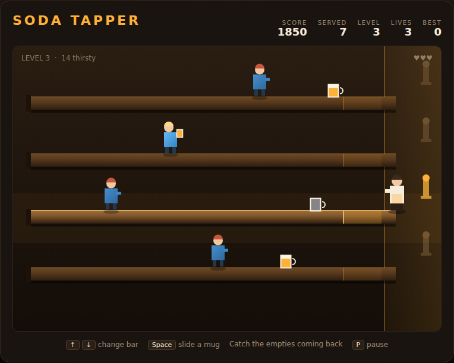

# Soda Tapper

A four-lane bar-service arcade game in the spirit of *Tapper*. You are the
bartender; they are thirsty; the bar is only so long.

Open `index.html` in any browser — no build step, no server.



## How to play

Customers file in from the far end of each of the four bars and walk steadily
toward you. Slide a mug down a lane and the nearest customer in it grabs the
drink, stops to drink it, and staggers back the way they came. Keep pushing and
they eventually fall off the far end of the bar — served, and worth points.

Every drink comes back at you. A customer who finishes a mug sends the empty
gliding down the bar; be standing in that lane when it reaches the lit stretch in
front of you and you catch it for a bonus. Be somewhere else and it sails past
your end and smashes, and that costs a life.

So does a mug you poured down an empty lane — it runs off the far end and
shatters. And so does a customer who reaches your end of the bar, because they
reach over and grab you by the collar.

Lose a life and the bar is swept: every mug in flight disappears and the
customers still standing are shoved back out of arm's reach. Lose your last one
and the night is over.

Clear a whole wave and the next level starts with more customers, walking
faster.

## Controls

| Input | Action |
|---|---|
| `↑` `↓` or `W` `S` | move up or down one bar |
| `Space` / `Enter` | pour and slide a mug (also starts, or restarts after game over) |
| Click the canvas | pour and slide a mug |
| `P` | pause |

## Scoring

| Event | Points |
|---|---|
| Customer served (pushed off the far end) | 150 |
| Empty mug caught | 50 |
| Wave cleared | 500 |

The best score is kept in `localStorage` under `sodatapper-best`.

## Strategy

- **Count the drinks you have already committed.** A mug in flight, a customer
  mid-drink and a queued round all push that customer back 110px each. Pour a mug
  the lane no longer needs and it runs off the far end and smashes — this is the
  single most common way to lose.
- **Stack mugs on the ones who are getting close.** A mug that reaches a customer
  who is already drinking waits its turn rather than being wasted, so two or
  three mugs in a lane will shove someone off the bar far faster than feeding
  them one at a time. On the later levels it is the only thing that outruns them.
- **Every mug you pour is an empty you owe.** Stacking three mugs means three
  empties coming home together, and you can only be in one lane at a time. Space
  out pours across lanes so their returns do not collide.
- **Serve early.** A customer near the far end needs one mug; a customer halfway
  down needs three. The cost of ignoring a lane compounds.

## Implementation

See [DESIGN.md](DESIGN.md) for the mechanics, the tuning constants and the
assumptions taken where the original arcade game was ambiguous. The tests live
in `tests/sodatapper.spec.js` and drive `step(dt)` directly, so every timing
assertion is exact rather than wall-clock dependent.

```
npx playwright test SodaTapper/tests/
```
