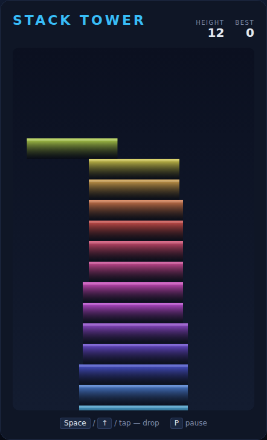

# Stack Tower

A one-button block-stacking arcade game, built with plain HTML5 canvas and
JavaScript — no build step, no dependencies. A block slides back and forth
across the top of a growing tower. Drop it: whatever hangs over the block below
is sliced off and falls away, and the overlap becomes your new — narrower —
platform. Nail a drop dead-centre for a **perfect** and keep your full width;
miss the block below entirely and it's game over.



## How to play

Open `index.html` in any modern browser. Press **Space** (or **↑**, click
**Start Game**, or tap the canvas) to begin.

| Input | Action |
|---|---|
| Space / ↑ / W / tap | Drop the block — and start / restart the game |
| P | Pause / resume |

- Every imperfect drop trims the overhang, so the tower gets **narrower** the
  more you misjudge — the higher you climb, the smaller your target.
- Line the block up within a few pixels of the one below for a **perfect**: the
  width is preserved and a **combo** counter climbs with each perfect in a row.
- The block slides **faster** as the tower grows.
- Your score is the tower's **height** (blocks stacked). Your best is saved in
  the browser's `localStorage`.

The game ends the moment a dropped block completely misses the one below.

## Development

Stack Tower follows the repo-wide test setup. From the repository root:

```powershell
npm install
npx playwright install chromium
npx playwright test StackTower/tests/
```

See [DESIGN.md](DESIGN.md) for how the code is structured, the slicing/perfect
rules, and how the game is made deterministic for testing.
