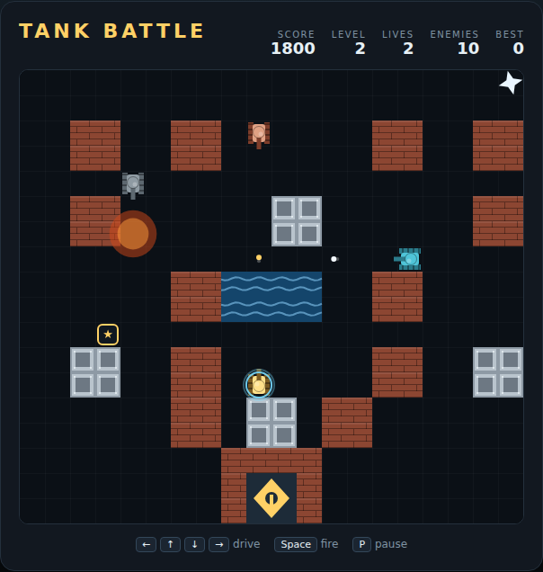

# Tank Battle

A top-down arena shooter on an HTML5 canvas. Drive your tank around a walled
arena of brick, steel and water, wipe out every enemy tank that rolls in from the
top edge, and keep them away from the command base behind you.



## Playing

Open `index.html` in a browser — no build step or server required. Press
<kbd>Space</kbd> or click **Start Game**.

## Controls

| Input | Action |
|---|---|
| <kbd>←</kbd> <kbd>→</kbd> <kbd>↑</kbd> <kbd>↓</kbd> or <kbd>W</kbd><kbd>A</kbd><kbd>S</kbd><kbd>D</kbd> | drive (hold) |
| <kbd>Space</kbd> | fire |
| <kbd>Space</kbd> / <kbd>Enter</kbd> | start, or play again after game over |
| <kbd>P</kbd> | pause / resume |

Let go of the keys and your tank stops but keeps facing where it last drove, so
you can hold a corridor and shoot down it.

## How to play

You have three tanks and one base. A wave is over when every enemy tank in it has
been destroyed; the counter in the HUD shows how many are left, on the field and
still to arrive.

**The arena is destructible, and that cuts both ways.**

- **Brick** (`red`) disappears a tile at a time when anything shoots it. Every
  shot you take at a wall opens a lane an enemy can use.
- **Steel** (`grey`) shrugs off ordinary shells. Only a star-upgraded shell cuts
  through it.
- **Water** (`blue`) stops tanks but not shells — good cover to shoot across.

**Defend the base.** It sits in the bottom wall inside a brick cocoon, with a
steel plug sealing the lane directly above it, so tanks have to come at it from
the flanks. One shell that reaches it ends the run — including one of yours, so
watch your line of fire when you are down near it.

**Know the tanks.**

| Tank | Speed | Hits to kill | Points |
|---|---|---|---|
| Grey (basic) | moderate | 1 | 100 |
| Cyan (fast) | quick | 1 | 200 |
| Rust (armour) | slow | 2 | 300 |

A tank arriving on the field spends a moment flashing in — it cannot shoot you
and you cannot shoot it, so use the time to get into position.

**Power-ups.** Every fourth kill drops one on an open tile. They are worth 200
points each and fade after a few seconds.

- **S — shield**: eight seconds of invulnerability.
- **★ — star**: a faster shell that cuts steel. You lose it if you lose a tank.
- **♥ — life**: one more tank.

**One shell at a time.** Yours has to land or leave the arena before you can fire
again, and so does every enemy's. Two shells that meet head-on cancel each other
out — you can shoot an incoming shell out of the air.

Clearing a wave pays a 500 bonus and loads the next arena. There are three
arenas; after the third they cycle with more, faster and tougher tanks. The run
ends when you lose your last tank or the base, and your best score is kept in
`localStorage`.

## Scoring

| Event | Points |
|---|---|
| Basic tank | 100 |
| Fast tank | 200 |
| Armour tank | 300 |
| Power-up collected | 200 |
| Wave cleared | 500 |

## Development

The game is plain HTML, CSS and JavaScript in three files: `index.html`,
`style.css` and `game.js`. `DESIGN.md` explains how the code works, including the
grid format for the arenas and the enemy AI.

Playwright specs live in `tests/`. From the repo root:

```powershell
npx playwright test TankBattle/tests/
```
