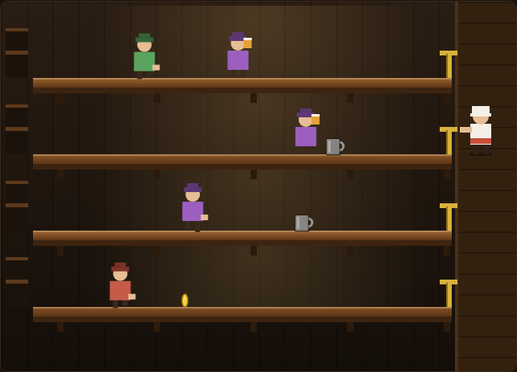

# Tapper

A lane-based service arcade game on an HTML5 canvas. You are the barkeep of a
four-counter soda saloon. Thirsty customers walk in at the far end of each bar and
shuffle toward the taps where you stand. Slide a mug down a bar, the nearest
customer catches it and is shoved back toward the door — but every mug they empty
comes sliding straight back at you, and glass that reaches the taps unattended
hits the floor.



## Playing

Open `index.html` in any modern browser. No build step and no server required.

## Controls

| Input | Action |
|---|---|
| `↑` `↓` / `W` `S` | move between bars |
| `Space` | pour a mug (also starts the game when idle or after game over) |
| `Enter` | start / restart |
| `P` | pause / resume |

## How to play

**Serve the crowd.** Customers enter at the far end of a bar and walk toward you.
Press `Space` to slide a full mug down whichever bar you are standing at; the
nearest customer on that bar catches it, drinks, and is pushed back about a
quarter of the bar's length. Keep pushing and they eventually leave happy, which
is what counts toward the round.

**Catch the empties.** Every mug a customer finishes comes sliding back toward
the taps. Be standing at that bar when it arrives and you catch it for a small
bonus; be on another bar and it smashes on the floor, costing a life.

**Don't waste a pour.** A mug slid down an empty bar runs off the far end and
breaks — pouring blind is as expensive as being too slow.

**Watch every bar.** You lose a life if a customer reaches the taps, if a mug
runs off the end, or if an empty gets past you. The whole game is deciding which
bar can be left alone for the next two seconds.

**Take the tips.** Every fourth happy customer leaves a coin that rolls back
toward the taps. Catching it is worth 300 points; missing it costs nothing.

## Scoring

| Event | Points |
|---|---|
| Customer takes a mug | 50 |
| Empty mug caught at the taps | 25 |
| Customer leaves happy | 200 |
| Tip collected | 300 |

Clear a round by sending `5 + level` customers away happy. Each round brings a
bigger crowd that walks faster and arrives more often. You get three lives, and
the best score is saved in your browser.

## Development

Tests live in `tests/` and run from the repository root:

```powershell
npx playwright test Tapper/tests/
```

See [DESIGN.md](DESIGN.md) for how the code is put together.
