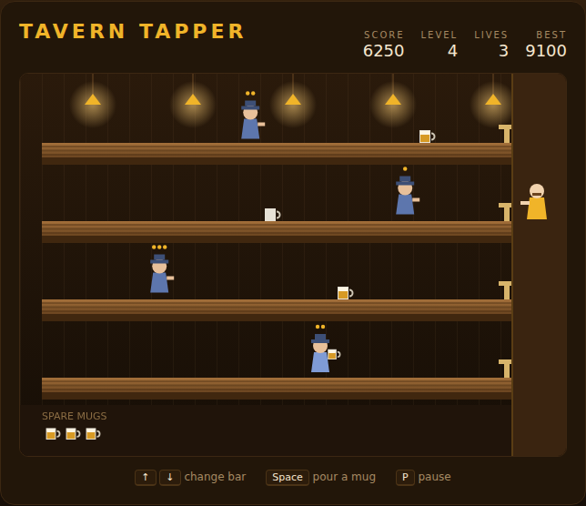

# Tavern Tapper

A four-bar drink-serving arcade game, built with plain HTML5 canvas and
JavaScript — no build step, no dependencies. You are the barkeep at the taps on
the right. Thirsty patrons come in through the door on the left and walk toward
you; slide mugs down the bar to keep them drinking, and catch the empties they
send back.



## How to play

Open `index.html` in any modern browser. Press **Space** (or click **Start
Game**) to begin.

| Key | Action |
|---|---|
| ↑ / W | Move up one bar |
| ↓ / S | Move down one bar |
| Space | Pour a mug into the bar you are standing at |
| Click | Pour a mug |
| P | Pause / resume |
| Space / Enter | Start a game, or start a fresh shift after a game over |

- Each patron arrives with a **thirst**, shown as gold pips above their hat: one
  mug early on, two from level 3, three from level 6. Land that many mugs and
  they head home happy.
- A mug always reaches the patron **nearest the taps** in that bar, so the front
  of the queue is served first.
- Every drink shoves a patron back down the bar and stops them for a moment, so
  serving is also how you buy time. A patron shoved as far as the door waits
  there until their last mug lands.
- **Pour only what the bar needs.** A mug served into an empty bar runs off the
  far end and smashes.
- A patron sent home slides their **empty mug** back toward you. Be standing in
  that bar when it arrives to catch it, or it shatters.
- A smashed mug, a missed empty, or a patron reaching the taps each costs one of
  your three spare mugs — the lives shown on the floorboards.
- Clearing every patron in a level pays a **500-point bonus**; the next level
  sends more patrons, walking faster, wanting more.
- Scoring: 50 per mug landed, 200 per patron sent home, 100 per empty caught.
  Your best score is saved in the browser's `localStorage`.

## Development

Tavern Tapper follows the repo-wide test setup. From the repository root:

```powershell
npm install
npx playwright install chromium
npx playwright test TavernTapper/tests/
```

See [DESIGN.md](DESIGN.md) for how the simulation, the level ladder and the
deterministic test hooks are built — and for the balance work behind the rules.
