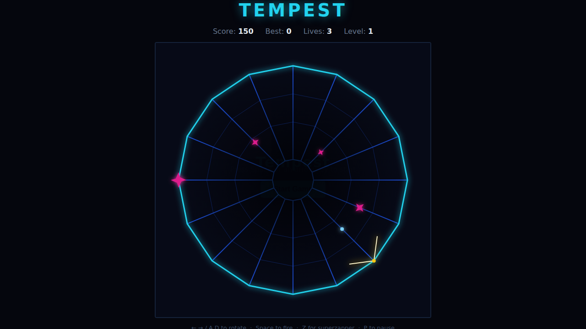

# Tempest

A canvas tribute to Atari's 1981 vector classic. You pilot the **Blaster** on
the rim of a tube — the "well" — viewed straight down its throat. Flippers
climb the lanes from the depths toward you; rotate around the rim and fire down
the lanes to destroy them before they reach the top. Clear the well to dive
into the next, faster level.



## How to play

- **Fire down the lanes.** Your shots travel inward and destroy any flipper on
  the same lane once they reach it. Each kill scores 150.
- **Watch the rim.** A flipper that climbs all the way to the outer rim latches
  on and chases you around the ring. If one reaches your lane you lose a life.
- **Superzapper.** Once per level you can wipe every enemy in the well — save it
  for when the rim gets crowded.
- **Clear the well.** Destroy every flipper (and let the spawn quota run dry) to
  bank a level bonus and drop into a harder level.

## Controls

| Key             | Action                            |
|-----------------|-----------------------------------|
| **← / A**       | rotate anticlockwise              |
| **→ / D**       | rotate clockwise                  |
| **Space**       | fire (also starts the game)       |
| **Z / Shift**   | superzapper (once per level)      |
| **P**           | pause / resume                    |

## Scoring

- **+150** per flipper destroyed.
- **+1000 × level** for clearing the well.
- Your best score is saved in the browser via `localStorage`.

## Running

Open `index.html` directly in any modern browser — no build step or server
needed.

## Development

Tests are written with Playwright and live in `tests/`. From the repo root:

```powershell
npx playwright test Tempest/tests/
```

See [DESIGN.md](DESIGN.md) for the well's coordinate system, the game-state
functions and the simplifying assumptions made in this version.
