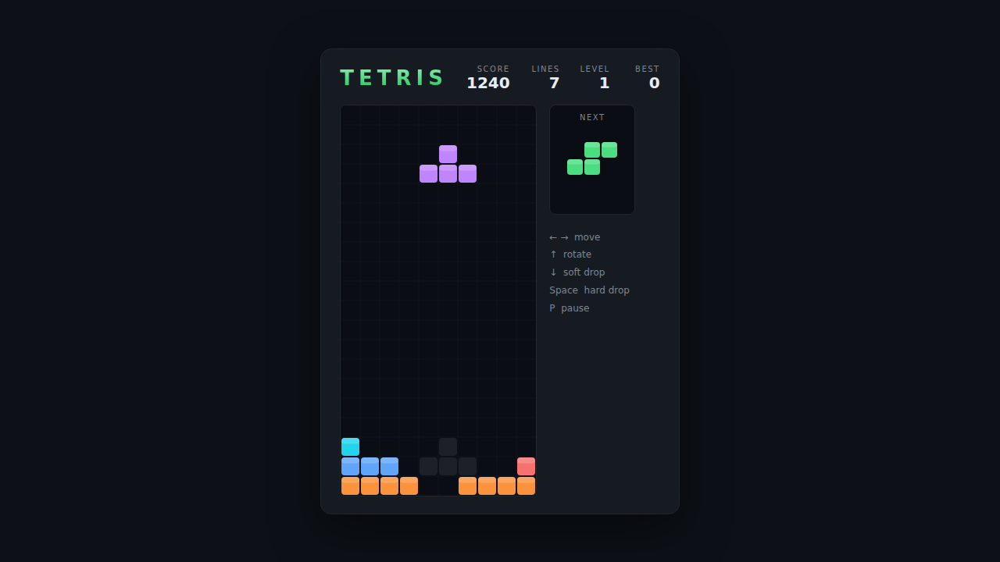

# Tetris

The classic falling-block puzzle, built with plain HTML5 canvas and JavaScript —
no build step, no dependencies. Slide and rotate the seven tetrominoes to pack
complete rows; clear rows to score, level up, and stay ahead of the rising
stack.



## How to play

Open `index.html` in any modern browser. Press any arrow key or **Space** (or
click **Start Game**) to begin.

| Key | Action |
|---|---|
| ← / → | Move the piece left / right |
| ↑ | Rotate clockwise |
| ↓ | Soft drop (fall one row, +1 point) |
| Space | Hard drop (slam to the bottom and lock) |
| P | Pause / resume |

- Clear **1 / 2 / 3 / 4** rows at once for **100 / 300 / 500 / 800** points,
  multiplied by your current level.
- Every 10 cleared lines raises the level and speeds up the drop.
- A translucent **ghost** shows where the current piece will land.
- Your best score is saved in the browser's `localStorage`.

The game ends when a new piece can no longer fit at the top of the well.

## Development

Tetris follows the repo-wide test setup. From the repository root:

```powershell
npm install
npx playwright install chromium
npx playwright test Tetris/tests/
```

See [DESIGN.md](DESIGN.md) for how the code is structured.
