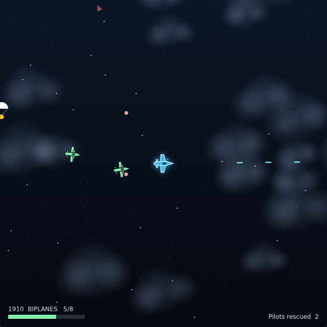

# Time Pilot

A 360-degree free-flight shooter. Your plane sits in the middle of the screen
and never stops moving — steering turns the whole world around you. Shoot down
enough enemies and the clock jumps to the next era.



## Play

Open `index.html` in any browser. No build step, no server.

## Controls

| Input | Action |
|---|---|
| `←` / `→`, or `A` / `D` | Turn left / right |
| `Space` | Fire — also starts a game from the title or game-over screen |
| Click the canvas | Fire |
| `P` | Pause / resume |

## How it plays

- **You always fly forward.** There is no throttle and no brake. The only
  control is which way the nose points, so the game is about turning the
  battlefield to where you want it, not about managing speed.
- **Fill the era's quota.** The bar at the bottom left shows kills toward the
  next era. Reach it and the year jumps: 1910 biplanes → 1940 prop fighters →
  1970 jets → 1983 gunships → 2001 saucers, then back to 1910 with everything
  flying faster.
- **Enemies chase you.** They turn toward you slowly, which means they
  overshoot and swing back round — the swirl of planes is the game. They shoot
  when they have you lined up and are close enough.
- **Rescue the pilots.** Parachutes drift down ahead of you; fly into one for
  1000 points, worth more than any kill in any era. A chevron at the edge of
  the screen points to one that is off screen (red chevrons point to enemies).
- **Three lives.** An enemy bullet or a mid-air collision costs one, and you
  get two seconds of blinking invulnerability afterwards.

## Scoring

| Event | Points |
|---|---|
| 1910 biplane | 100 |
| 1940 prop fighter | 200 |
| 1970 jet | 300 |
| 1983 gunship | 400 |
| 2001 saucer | 500 |
| Pilot rescued | 1000 |

The best score is kept in `localStorage`.

## Files

| File | What it is |
|---|---|
| `index.html` | Page, HUD and overlay markup |
| `style.css` | Presentation, shared look with the rest of the arcade |
| `game.js` | The whole game: simulation, rendering, input |
| `DESIGN.md` | How the code works and why the numbers are what they are |
| `tests/time-pilot.spec.js` | Playwright suite (71 tests) |

## Tests

From the repository root:

```powershell
npx playwright test TimePilot/tests/
```

The suite freezes the animation loop (`autoRun = false`) and calls
`physicsStep(DT)` by hand, so every assertion is about a fixed number of
deterministic simulation steps rather than wall-clock animation.
