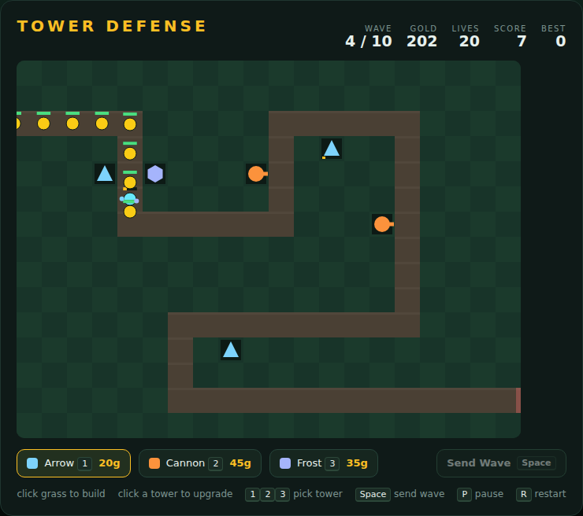

# Tower Defense

Ten waves of creeps march along a winding road from the left edge of the map to
the right. Spend gold on towers beside the road to stop them. Every creep that
walks off the far edge costs a life — lose all 20 and it's over.



## Playing

Open `index.html` in any browser. No build step, no server.

## How to play

1. The game opens in a **build phase**. Pick a tower and click a grass tile to
   build it. Road tiles can't be built on.
2. Press <kbd>Space</kbd> (or *Send Wave*) to release the wave. Towers fire on
   their own, always at the creep furthest along the road.
3. Kills pay gold; clearing a wave pays a bonus. Spend it on more towers, or
   click an existing tower to upgrade it (up to level 3).
4. Clear all 10 waves to win. Waves 5 and 10 finish with a boss.

## Towers

| Tower  | Key | Cost | Range | Damage | Rate   | Notes                           |
|--------|-----|------|-------|--------|--------|---------------------------------|
| Arrow  | 1   | 20g  | 2.6   | 6      | 2.0/s  | cheap, fast, single target      |
| Cannon | 2   | 45g  | 2.2   | 14     | 0.6/s  | 1-cell splash — good on packs   |
| Frost  | 3   | 35g  | 2.4   | 3      | 1.1/s  | slows the target to 45% for 1.5s |

Each upgrade costs the tower's base price, multiplies its damage by 1.6 and adds
a little range. A frost tower early on the road plus cannons at the hairpins is a
solid opening.

## Controls

| Input                 | Action                              |
|-----------------------|-------------------------------------|
| Click grass           | build the selected tower            |
| Click a tower         | upgrade it                          |
| <kbd>1</kbd> <kbd>2</kbd> <kbd>3</kbd> | select Arrow / Cannon / Frost |
| <kbd>Space</kbd>      | start game · send the next wave     |
| <kbd>P</kbd>          | pause / resume                      |
| <kbd>R</kbd>          | restart                             |

## Scoring

Score comes from kill bounties, wave-clear bonuses (`20 + 5 × wave`) and, on a
win, 25 points per surviving life. Your best score is kept in `localStorage`.

## Development

See [DESIGN.md](DESIGN.md) for how the code is organised.

Run the tests from the repo root:

```powershell
npx playwright test TowerDefense/tests/
```
