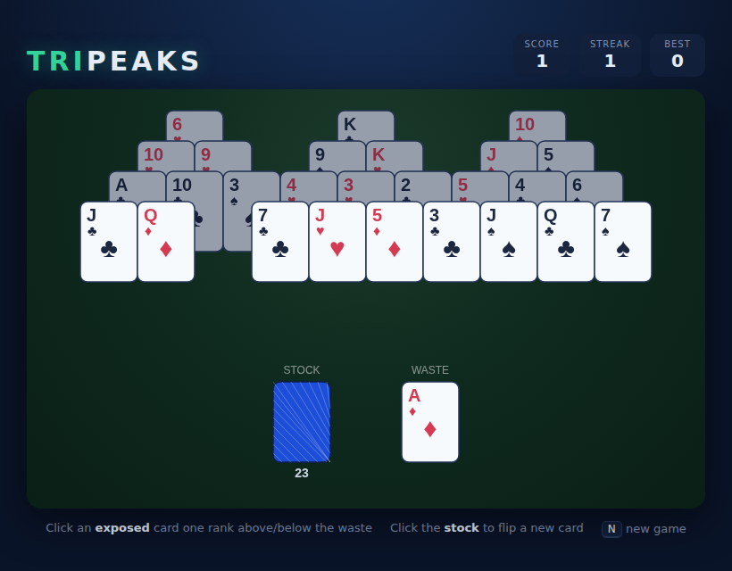

# TriPeaks Solitaire

A fast, single-deck solitaire built around **three overlapping pyramids**.
Clear the tableau by playing cards one rank **above or below** the top of the
waste pile — ranks wrap, so an Ace plays on both a King and a Two. Empty the
stock when you get stuck, and clear all 28 cards to win.



## How to play

- The top of the **waste** pile is your reference card.
- Click any **exposed** tableau card whose rank is one above or one below it to
  play it onto the waste. Only cards with nothing overlapping them are exposed.
- Playing a card may uncover new ones — chain plays together to build a
  **streak**: the *n*-th card in a run scores *n* points.
- Stuck? Click the **stock** to flip a fresh card to the waste. This resets
  your streak.
- Clear all three peaks to win (**+20 bonus**). If no move remains and the
  stock is empty, the game is lost.
- Your best score is saved between sessions.

## Controls

| Input | Action |
|---|---|
| **Click** an exposed card | Play it (if one rank above/below the waste) |
| **Click** the stock | Flip a new card to the waste |
| **N** | New game |
| **Space** / **Deal** button | Deal from the title / end screen |

## Running

Open `index.html` directly in any modern browser — no build step or server
required.

## Development

Tests are written with [Playwright](https://playwright.dev). From the repo
root:

```bash
npm install
npx playwright test TriPeaks/tests/tripeaks.spec.js
```

See [DESIGN.md](DESIGN.md) for the coverage model, the rules engine, and the
assumptions made.
