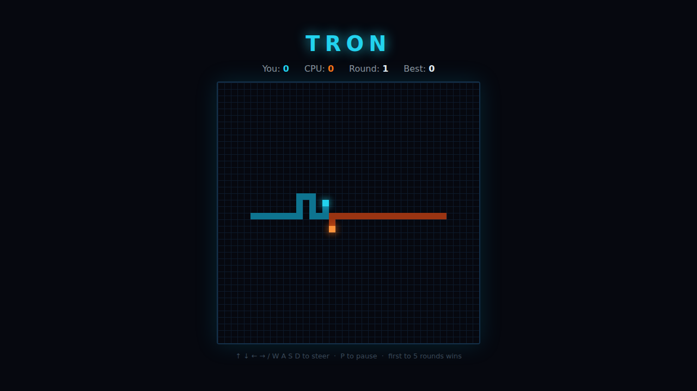

# Tron Light Cycles

A head-to-head light-cycle duel on an HTML5 canvas. Pilot your glowing cycle
around the arena, leaving a lethal wall of light behind you, and box the CPU
cycle in before it does the same to you. First to **5 rounds** wins the match.



## How to play

- Your cyan cycle starts on the left, the orange CPU on the right. Both move
  forward continuously and cannot stop or reverse.
- **Steer** with the arrow keys or **W A S D**. You can turn left or right but
  never a full 180° back into your own trail.
- You crash — and lose the round — the instant you drive into a wall, into your
  own trail, or into the CPU's trail. Same rules apply to the CPU.
- A head-on smash where both cycles hit the same cell is a **tie**, and the
  round is replayed.
- Win a round by surviving longer than the CPU. **First to 5 round wins** takes
  the match.

## Controls

| Input | Action |
|---|---|
| ↑ ↓ ← → / W A S D | Steer your cycle |
| Space / any arrow / **Start Game** | Start (or restart after a match) |
| P | Pause / resume |

The HUD tracks your round wins, the CPU's round wins, the current round, and
your **Best** (the most rounds you have ever won in a single match), which is
saved to `localStorage`.

## Running

Open `index.html` directly in any modern browser — no build step or server
required.

## Tests

Playwright specs live in `tests/tron.spec.js`. From the repository root:

```powershell
npx playwright test Tron/tests/
```

See [DESIGN.md](DESIGN.md) for how the code works, the deterministic tick model,
and the assumptions made.
