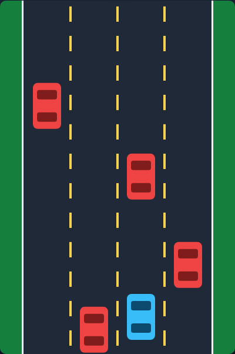

# Turbo Racer

A top-down endless racing / dodging arcade game. Weave your car up a four-lane
highway, dodging the traffic streaming toward you. The longer you survive, the
faster the road scrolls and the higher your score climbs. One collision ends
the run.



## How to play

Open `index.html` in any modern browser — no build step or server required.

| Input | Action |
|---|---|
| ← / A | Steer left |
| → / D | Steer right |
| Space / ↑ / any steer key | Start (from the title or game-over screen) |
| P | Pause / resume |

Your car is fixed near the bottom and only moves side to side; the world
scrolls beneath you to fake forward motion. Traffic appears one car at a time
in a random lane, so there is always a gap to thread. Speed and traffic density
ramp up the further you get. Your best score is saved in the browser between
sessions.

## How it works

See [DESIGN.md](DESIGN.md) for the full design: geometry, the frame-rate
independent `step(dt)` simulation, the seeded RNG used for traffic, scoring,
and difficulty scaling.

## Tests

Playwright tests live in `tests/turboracer.spec.js`. From the repo root:

```powershell
npx playwright test TurboRacer/tests/
```
