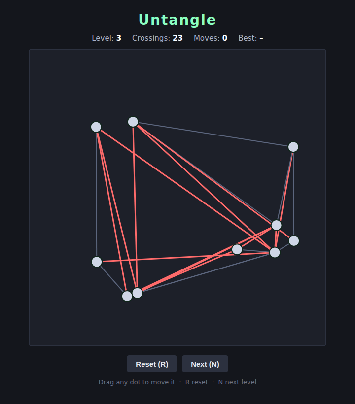

# Untangle

A tangle of dots and lines, drawn on an HTML5 canvas. Drag the dots until **no
two lines cross** to solve the puzzle. Every level is built from a graph that is
guaranteed to have a crossing-free layout — so a solution always exists. Also
known as *Planarity*.



## How to play

1. Open `index.html` in a browser (no server or build step needed).
2. Press **Start Game**.
3. **Drag any dot** to move it. Lines that currently cross are drawn **red**;
   clean lines are grey.
4. Rearrange the dots until the **Crossings** counter reaches **0** — the graph
   turns green and the level is solved.
5. Advance to the next, larger tangle.

### Controls

| Input               | Action                              |
|---------------------|-------------------------------------|
| Mouse / touch drag  | Move a dot                          |
| **R**               | Reset the level to its start layout |
| **N**               | Next level                          |
| On-screen buttons   | Reset · Next                        |

The HUD tracks the current **crossings**, your **moves** (completed drags), and
your fewest-moves **best** per level (saved in your browser).

## Levels

Four bundled levels of increasing size (6, 8, 10, and 12 dots) are generated
deterministically from fixed seeds, so each level is the same every time and can
be reset exactly. See [`design.md`](design.md) for how the always-solvable
graphs are generated.

## Development

Tests live in [`tests/untangle.spec.js`](tests/untangle.spec.js) and run with the
repo's Playwright setup:

```powershell
npx playwright test Untangle/tests/
```
