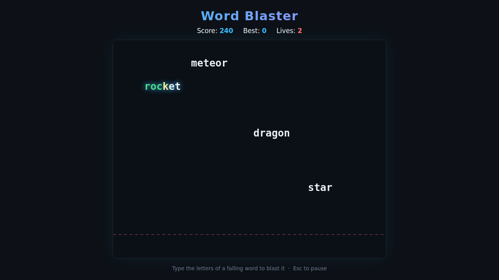

# Word Blaster

A typing arcade game. Words drift down from the top of the screen — **type
them** to blast them out of the sky before they cross the danger line. Miss
three words and it's game over.



## How to play

1. Open `index.html` in any browser — no build step or server required.
2. Press **any letter** (or click **Start Game**) to begin.
3. Words fall from the top. Start typing a word's letters to lock onto it:
   - The letters you've matched turn **green**.
   - The next letter you need glows **yellow**.
   - Finish the word to blast it and score `10 × (word length)` points.
4. Only one word is targeted at a time. Wrong keys are ignored, so a stray
   keystroke won't ruin a word you're in the middle of.
5. Every word that slips past the dashed danger line at the bottom costs a
   life. Lose all **3 lives** and the game ends.
6. It speeds up as you go — words fall faster and spawn more often.

## Controls

| Key | Action |
|---|---|
| `A`–`Z` | Type the falling words |
| `Esc` | Pause / resume |
| Any letter | Start / restart |

Pause is on **Esc** (not a letter) so every letter stays free for typing.

## Scoring

- **10 points per letter** of each word you complete.
- Your best score is saved in the browser via `localStorage`.

## Under the hood

See [DESIGN.md](DESIGN.md) for the game concept, mechanics, state model and the
test hooks used by the Playwright suite.

## Tests

```powershell
npx playwright test WordBlaster/tests/
```
