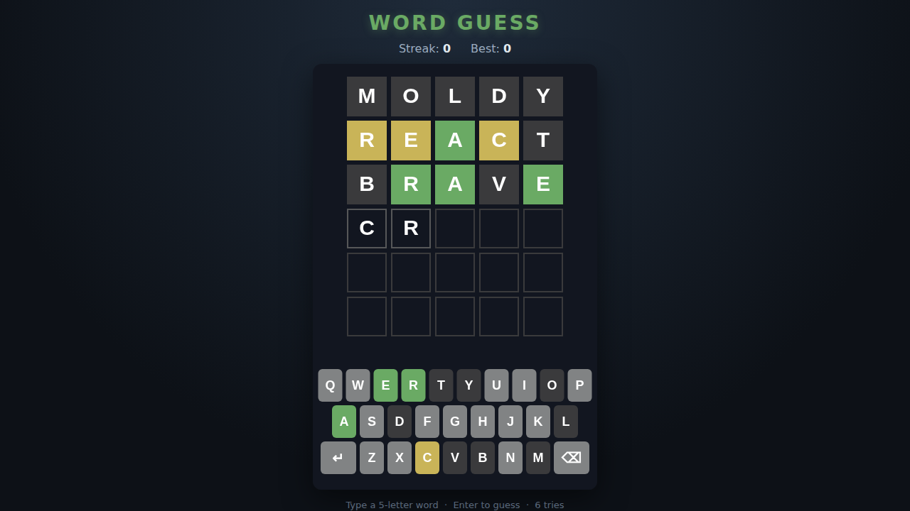

# Word Guess

A five-letter word-deduction game in the spirit of Wordle. You get **six
tries** to find the hidden word. Each guess is colored to show how close you
are, and the on-screen keyboard remembers what you've learned.



## How to play

| Input | Action |
|---|---|
| Letter keys `A`–`Z`, or click on-screen keys | Type a letter |
| `Backspace` / on-screen ⌫ | Delete a letter |
| `Enter` / on-screen ↵ | Submit the guess |
| `Space` / start button | New game |

After each guess every tile is colored:

- 🟩 **Green** — right letter, right spot.
- 🟨 **Yellow** — the letter is in the word, but somewhere else.
- ⬛ **Gray** — the letter isn't in the word.

Duplicate letters follow the usual rule: extra copies you guess beyond the
number actually in the word show up gray.

- Guesses must be real five-letter words from the game's list.
- Win within six tries to grow your **streak**; a loss resets it and reveals
  the answer. Your best streak is saved in the browser.

## Playing

Open `index.html` directly in any modern browser — no build step or server
required.

## Development

Tests are written with [Playwright](https://playwright.dev/) and live in
`tests/`. From the repository root:

```powershell
npm install
npx playwright install chromium
npx playwright test WordGuess/tests/
```

See [DESIGN.md](DESIGN.md) for how the code is structured and how the scoring
logic is exposed for deterministic testing.
