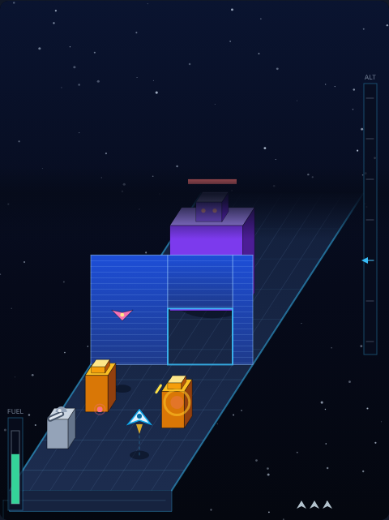

# Zaxxon

An isometric raid on a space fortress. The deck slides past beneath you, and the
one thing that decides everything is your **altitude**: your cannon fires level,
at exactly the height you are flying, so a gun bolted to the deck can only be
destroyed from low down — and low down is where the deck can kill you.



## How to play

1. Press **Space**, or click **Start Game**.
2. Steer across the deck with **←/→** or **A/D**.
3. Climb and dive with **↑/↓** or **W/S** — watch the **ALT** ladder on the
   right, and the shadow under your ship.
4. Hold **Space** to fire.
5. Fly through the opening in each force wall, shoot the robot at the end of the
   sector, and do it four times.

Your tank is always draining. The only refill is a **fuel tank** on the deck, and
the only way to shoot one is to drop down to its height — which is the whole
bargain the game offers you.

## Targets and points

| Target | Points | Notes |
|---|---|---|
| Fuel tank | 150 | returns 30 fuel — your only way to top up |
| Gun turret | 200 | shoots at wherever you are, so keep moving |
| Enemy fighter | 300 | cruises at a fixed height; match it to hit it |
| Force wall | — | cannot be shot; fly through the opening |
| Robot | 2000 | six hits, and the sector is yours |

Clearing a sector pays **1000 plus 10 per unit of fuel** still in the tank, so
arriving at the robot with a full tank is worth as much as a handful of turrets.
Three ships, four sectors, and your best score is remembered between sessions.

## Controls

| Input | Action |
|---|---|
| `←` `→` / `A` `D` | steer across the deck |
| `↑` `↓` / `W` `S` | climb and dive |
| `Space` (tap or hold) / click | start, fire, or dismiss an overlay |
| `P` | pause and unpause |

## Tips

- The dotted line to your shadow is the honest read on your height; the sprite
  alone is ambiguous, exactly as it was in the arcade.
- A turret shoots at where you *are*, not where you are going. Drifting sideways
  or climbing even slightly as the shot flies is enough to make it miss.
- Walls come in two flavours: an opening low down means dive, an opening high up
  means climb. Commit early — the ship has to fit through whole.
- Shoot the fuel tanks you pass even when the gauge looks healthy. The next
  chance may be on the far side of a wall.
- Against the robot, level out around mid-height: its hitbox covers most of the
  deck, so you can fire while still having room to dodge.

## Files

- `index.html` — page shell, HUD, canvas and overlay
- `style.css` — cabinet styling
- `game.js` — simulation, isometric projection and rendering
- `DESIGN.md` — how the game works internally, and the assumptions behind it
- `tests/zaxxon.spec.js` — Playwright suite

Run the tests from the repository root:

```powershell
npx playwright test Zaxxon/tests/
```
