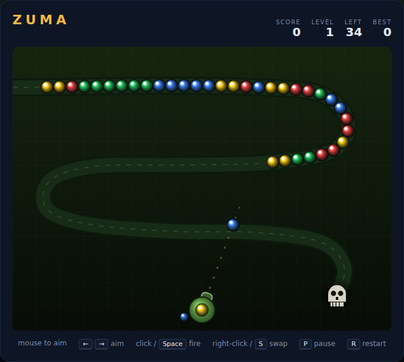

# Zuma

A marble-shooter arcade game, built with plain HTML5 canvas and JavaScript — no
build step, no dependencies. A chain of coloured marbles crawls along a winding
stone track toward a skull-hole. A launcher in the middle of the field fires
marbles into the chain; line up **three or more of the same colour** and they
pop. Clear the whole chain before it reaches the hole.

Inspired by the 2003 PopCap classic.



## How to play

Open `index.html` in any modern browser. Press **Space** (or click **Start
Game**) to begin.

| Input | Action |
|---|---|
| Mouse move | Aim the launcher |
| Left click | Fire |
| Right click | Swap the current and next marble |
| ← / → | Rotate the aim |
| Space | Start the game / fire |
| S | Swap the current and next marble |
| P | Pause / resume |
| R | Restart |

The launcher holds the marble it is about to fire and shows the next one tucked
behind it. Swapping is free and unlimited, so use it whenever the queued colour
is the one you actually need.

## Rules

- Marbles feed onto the back of the track and shuffle forward as one packed
  chain. The chain never stops.
- A fired marble wedges itself into the chain wherever it makes contact. Nothing
  is lost if it doesn't match — the chain just gets one marble longer.
- **Three or more** touching marbles of the same colour pop and are removed.
- When a pop leaves two same-coloured groups facing each other and they add up
  to three or more, they pop too — a **combo**, and each step of a combo is
  worth progressively more.
- The level is cleared once the track *and* the supply of marbles are both
  empty. Every level after that runs faster, uses more colours and sends more
  marbles.
- The track glows red when the leading marble gets close to the hole. If it
  reaches the hole, the run is over.

## Scoring

| Event | Points |
|---|---|
| Popping a run | 10 × marbles in the run × combo step |
| Clearing a level | 100 × level number |

The best score is saved in your browser's local storage.

## Tips

- The launcher only ever hands you colours that are still in play, so there is
  no such thing as a wasted colour — only a wasted shot.
- Deliberately parking a spare marble next to a pair sets up a combo later. Two
  pops in one shot are worth more than the same marbles popped one at a time.
- The chain closes gaps quickly. If you want a combo, fire before the gap shuts.
- Shooting into the far end of the chain buys the most time; shooting near the
  tail barely delays anything.

## Files

| File | Purpose |
|---|---|
| `index.html` | Markup: HUD, canvas and overlay |
| `style.css` | Dark arcade theme |
| `game.js` | Track geometry, chain physics, matching and rendering |
| `DESIGN.md` | How the code works and what was assumed |
| `tests/zuma.spec.js` | Playwright test suite |

## Tests

From the repository root:

```powershell
npx playwright test Zuma/tests/
```
